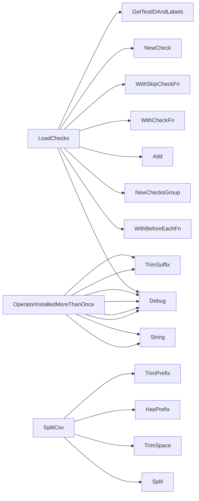

## Package operator (github.com/redhat-best-practices-for-k8s/certsuite/tests/operator)

## Operator Test Package Overview

The `operator` package implements a suite of tests that validate the behavior and compliance of Kubernetes Operators in a Red‑Hat Certified environment.  
It orchestrates checks on CRDs, catalog sources, installation phases, SCC permissions, and versioning rules.

---

### Key Data Structures

| Type | Purpose | Notes |
|------|---------|-------|
| **`CsvResult`** (file `helper.go:35`) | Holds the result of parsing a CSV string into a *name* and *namespace*. | Two fields: `NameCsv`, `Namespace`. It is used by tests that iterate over operator CSVs. |

No other public structs are defined in this package; most logic relies on helper functions and objects from external packages (`provider`, `checksdb`, etc.).

---

### Global Variables

| Name | Type | Usage |
|------|------|-------|
| `env` (line 41) | `provider.TestEnvironment` | Holds the test environment passed to all check functions. It contains Kubernetes client, logger, and configuration data. |
| `beforeEachFn` (line 43) | *unused* | A placeholder for a “BeforeEach” hook used by the testing framework; not referenced elsewhere in this code snapshot. |

---

### Core Helper Functions

#### Parsing CSVs
```go
func SplitCsv(csv string) CsvResult
```
Splits `name,namespace` strings into structured data.

#### Operator Installation Validation
```go
func checkValidOperatorInstallation(name string) (bool, []string, error)
```
* Verifies that a given operator is correctly installed.*
1. Retrieves all CSVs (`getCsvsBy`) and pods (`getAllPodsBy`).  
2. Determines if the operator is single‑ or multi‑namespaced (`isSingleNamespacedOperator`, `isMultiNamespacedOperator`).  
3. Checks for duplicate installations, namespace conflicts, and orphaned pods (`findPodsNotBelongingToOperators`).  

#### Duplicate Detection
```go
func OperatorInstalledMoreThanOnce(op1, op2 *provider.Operator) bool
```
Compares two operators’ names and namespaces to detect multiple installations of the same operator.

#### Pod‑Owner Mapping
```go
func findPodsNotBelongingToOperators(name string) ([]string, error)
```
Collects pods that do not belong to any operator in the namespace set. Uses `GetPodTopOwner` from `podhelper`.

---

### Main Test Functions (executed by the test runner)

All functions have the signature `func(*checksdb.Check, *provider.TestEnvironment)` and are registered in `LoadChecks()`.

| Function | What it verifies |
|----------|-----------------|
| `testOperatorInstallationPhaseSucceeded` | Waits for operator CR to reach **Ready** phase. |
| `testOperatorInstallationAccessToSCC` | Ensures operator pods have no forbidden SCC rules. |
| `testOperatorOlmSubscription` | Validates the presence and correctness of an OLM subscription. |
| `testOperatorCatalogSourceBundleCount` | Checks that catalog source bundles match expected count per channel. |
| `testOperatorSemanticVersioning` | Confirms operator image tags follow semantic‑version rules. |
| `testOperatorCrdOpenAPISpec` | Verifies the operator CRD uses OpenAPI 3 schema. |
| `testOperatorCrdVersioning` | Ensures CRD version names are valid Kubernetes versions. |
| `testOperatorPodsNoHugepages` | Detects pods requesting hugepage memory. |
| `testOperatorSingleCrdOwner` | Checks that a single operator owns its CRDs. |
| `testOnlySingleOrMultiNamespacedOperatorsAllowedInTenantNamespaces` | Ensures operators are installed only in dedicated namespaces or tenant‑operator namespace. |
| `testMultipleSameOperators` | Detects duplicate installations of the same operator. |

Each test builds a *report object* (e.g., `NewOperatorReportObject`) and appends fields that describe success/failure, then sets the result on the check.

---

### Test Registration (`LoadChecks`)

```go
func LoadChecks() func()
```

1. **Setup** – Configures a `BeforeEach` hook to capture the test environment into the global `env`.  
2. **Check Groups** – Creates a group per operator feature (e.g., installation, catalog source).  
3. **Add Checks** – For each feature, creates a `checksdb.Check`, supplies:
   * Test ID and labels via `GetTestIDAndLabels`
   * Skip logic (`GetNoOperatorsSkipFn`, `GetNoOperatorCrdsSkipFn`)
   * The actual test function (e.g., `testOperatorInstallationPhaseSucceeded`).

The returned closure is invoked by the test harness to register all checks.

---

### Interaction Flow

```
Test Runner
  └─> LoadChecks() → registers checks
        ├─> BeforeEachFn captures env
        └─> Each Check runs:
                ├─> Helper functions (SplitCsv, checkValidOperatorInstallation, etc.)
                ├─> Provider client queries resources
                ├─> Report objects collect findings
                └─> Result set on checksdb.Check
```

---

### Mermaid Diagram Suggestion

```mermaid
flowchart TD
    A[Test Runner] --> B[LoadChecks]
    B --> C[BeforeEachFn (sets env)]
    B --> D{Check Groups}
    D --> E[Operator Installation Checks]
    D --> F[Crd & Catalog Source Checks]
    E --> G[testOperatorInstallationPhaseSucceeded]
    G --> H[WaitOperatorReady]
    G --> I[Report Object]
    F --> J[testOperatorCatalogSourceBundleCount]
    J --> K[GetCatalogSourceBundleCount]
    K --> L[Report Object]
```

---

### Summary

* The package provides a comprehensive, data‑driven test suite for operator compliance.  
* It relies heavily on helper functions that query the Kubernetes API via `provider.TestEnvironment`.  
* Report objects aggregate results, while global variables maintain context across checks.  
* All logic is read‑only; no state mutation occurs outside of building reports and setting check outcomes.

### Structs

- **CsvResult** (exported) — 2 fields, 0 methods

### Functions

- **LoadChecks** — func()()
- **OperatorInstalledMoreThanOnce** — func(*provider.Operator, *provider.Operator)(bool)
- **SplitCsv** — func(string)(CsvResult)

### Globals


### Call graph (exported symbols, partial)



### Symbol docs

- [struct CsvResult](symbols/struct_CsvResult.md)
- [function LoadChecks](symbols/function_LoadChecks.md)
- [function OperatorInstalledMoreThanOnce](symbols/function_OperatorInstalledMoreThanOnce.md)
- [function SplitCsv](symbols/function_SplitCsv.md)
