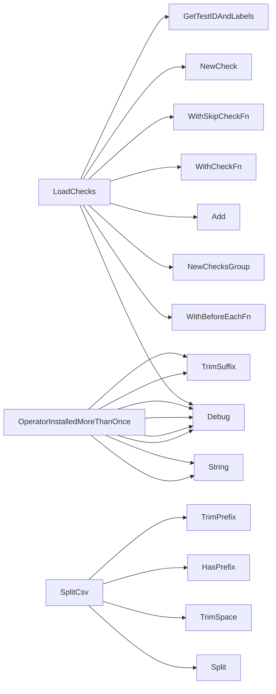

## Package operator (github.com/redhat-best-practices-for-k8s/certsuite/tests/operator)

### Structs

- **CsvResult** (exported) — 2 fields, 0 methods

### Functions

- **LoadChecks** — func()()
- **OperatorInstalledMoreThanOnce** — func(*provider.Operator, *provider.Operator)(bool)
- **SplitCsv** — func(string)(CsvResult)

### Globals

### Call graph (exported symbols, partial)

### Symbol docs

- [struct CsvResult](symbols/struct_CsvResult.md)
- [function LoadChecks](symbols/function_LoadChecks.md)
- [function OperatorInstalledMoreThanOnce](symbols/function_OperatorInstalledMoreThanOnce.md)
- [function SplitCsv](symbols/function_SplitCsv.md)
