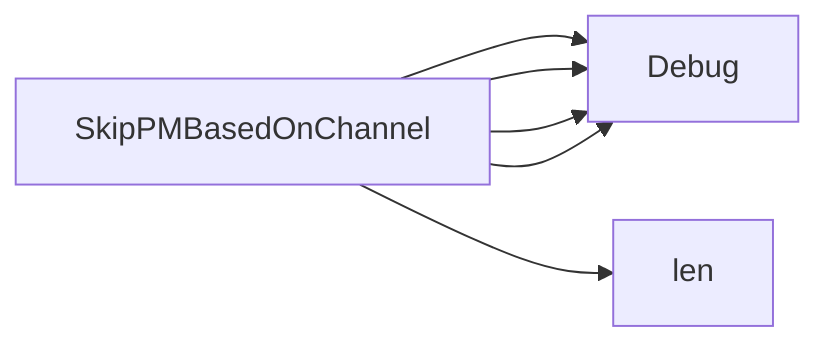

## Package catalogsource (github.com/redhat-best-practices-for-k8s/certsuite/tests/operator/catalogsource)

# catalogsource – Quick Overview

The **catalogsource** package contains a single helper that determines whether a given Operator‑Lifecycle‑Manager (OLM) package should be skipped based on the channel it is served from.

---

## Imports
| Package | Purpose |
|---------|---------|
| `github.com/operator-framework/operator-lifecycle-manager/pkg/package-server/apis/operators/v1` (`olmpkgv1`) | Provides the `PackageChannel` type – a representation of an OLM package’s channel. |
| `github.com/redhat-best-practices-for-k8s/certsuite/internal/log` | Lightweight logger used for debug‑level tracing. |

---

## Key Function

### `SkipPMBasedOnChannel`
```go
func SkipPMBasedOnChannel(channels []olmpkgv1.PackageChannel, channel string) bool
```

#### Purpose
Given a slice of `PackageChannel`s (the channels that an OLM package is available on) and the name of a *catalog source* channel, decide if this package should be **skipped** during tests.

The function follows these rules:

| Step | Action |
|------|--------|
| 1 | If the catalog source channel is empty (`""`), log the decision and return `false` – never skip. |
| 2 | Count how many of the supplied channels match the catalog source channel. |
| 3 | If none match, return `true` (skip). |
| 4 | If more than one match exists, it is considered an error scenario; log it and return `true`. |
| 5 | Otherwise (exactly one match) return `false`. |

#### Implementation Notes
* The function uses only the standard library’s `len` for counting.
* All decision points are logged at debug level – useful when troubleshooting test runs.

---

## How It Fits in the Test Suite

1. **Test Setup**  
   During a catalog‑source test, each OLM package is fetched along with its available channels.

2. **Decision Point**  
   `SkipPMBasedOnChannel` is called for every package to decide if it should participate in the current channel’s tests.

3. **Outcome**  
   - `true`: The package is excluded from further validation steps.
   - `false`: The package proceeds to subsequent checks (e.g., verifying manifests, CRDs).

This helper keeps the test logic simple and isolates the channel‑matching logic into one place.

---

## Suggested Mermaid Diagram

```mermaid
flowchart TD
    A[Start] --> B{Is catalog channel empty?}
    B -- Yes --> C[Return false]
    B -- No --> D[Count matches in channels]
    D --> E{Matches == 0?}
    E -- Yes --> F[Return true (skip)]
    E -- No --> G{Matches > 1?}
    G -- Yes --> H[Log error, Return true]
    G -- No --> I[Return false]
```

---

### Summary
`catalogsource.SkipPMBasedOnChannel` is a small yet essential utility that filters OLM packages based on channel availability, ensuring that only relevant packages are evaluated during catalog‑source tests.

### Functions

- **SkipPMBasedOnChannel** — func([]olmpkgv1.PackageChannel, string)(bool)

### Call graph (exported symbols, partial)



### Symbol docs

- [function SkipPMBasedOnChannel](symbols/function_SkipPMBasedOnChannel.md)
