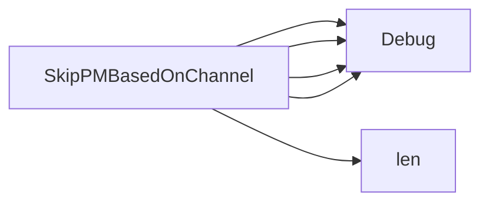

## Package catalogsource (github.com/redhat-best-practices-for-k8s/certsuite/tests/operator/catalogsource)

### Functions

- **SkipPMBasedOnChannel** — func([]olmpkgv1.PackageChannel, string)(bool)

### Call graph (exported symbols, partial)

### Symbol docs

- [function SkipPMBasedOnChannel](symbols/function_SkipPMBasedOnChannel.md)
