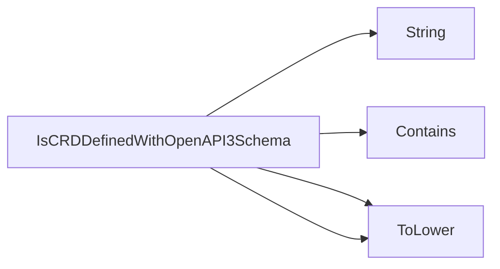

## Package openapi (github.com/redhat-best-practices-for-k8s/certsuite/tests/operator/openapi)

### Functions

- **IsCRDDefinedWithOpenAPI3Schema** — func(*apiextv1.CustomResourceDefinition)(bool)

### Call graph (exported symbols, partial)

### Symbol docs

- [function IsCRDDefinedWithOpenAPI3Schema](symbols/function_IsCRDDefinedWithOpenAPI3Schema.md)
