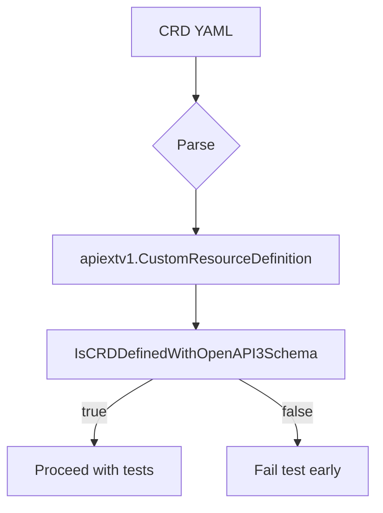
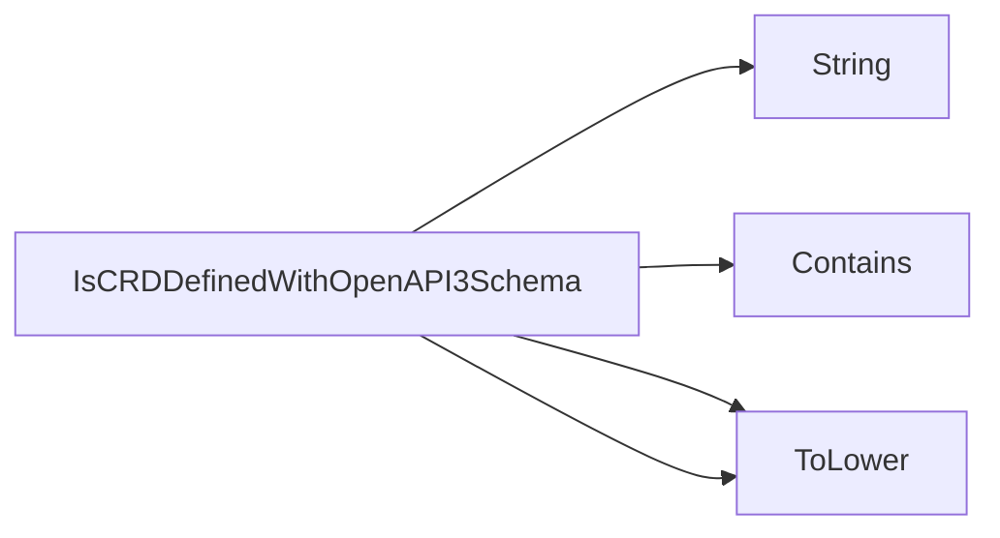

## Package openapi (github.com/redhat-best-practices-for-k8s/certsuite/tests/operator/openapi)

## Overview – `openapi` Test Package

The **`openapi`** package is a lightweight helper used by the CertSuite operator tests to verify that a CustomResourceDefinition (CRD) declares an OpenAPI v3 schema.  
Its single exported function, `IsCRDDefinedWithOpenAPI3Schema`, inspects the CRD’s stored validation definition and reports whether it contains the expected “openAPIV3Schema” field.

---

### Key Components

| Element | Description |
|---------|-------------|
| **Imports** | *`testhelper`* – for test‑related utilities (not used directly in the function).<br>*`apiextv1`* – Kubernetes CRD API definition.<br>*`strings`* – string manipulation. |
| **Global state** | None – the package is stateless and purely functional. |
| **Exported function** | `IsCRDDefinedWithOpenAPI3Schema(crd *apiextv1.CustomResourceDefinition) bool` |

---

### Function: `IsCRDDefinedWithOpenAPI3Schema`

#### Purpose
Determine whether a given CRD declares an OpenAPI v3 schema by checking for the presence of the `"openAPIV3Schema"` key inside its validation specification.

#### Signature
```go
func IsCRDDefinedWithOpenAPI3Schema(crd *apiextv1.CustomResourceDefinition) bool
```

#### Workflow

| Step | Implementation Detail |
|------|------------------------|
| 1. **Retrieve the stored schema** | Access `crd.Spec.Versions[0].Schema.OpenAPIV3Schema` – this is a `runtime.RawExtension`. |
| 2. **Convert to string** | Use `String()` on the RawExtension to get its JSON representation (the helper function converts `RawExtension` to `string`). |
| 3. **Normalize case** | Convert both the raw JSON and the search token `"openapiv3schema"` to lower‑case with `strings.ToLower`. |
| 4. **Search for key** | Call `strings.Contains` to see if the normalized schema string includes the normalized key. |
| 5. **Return result** | `true` if found, otherwise `false`. |

#### Example Usage
```go
if !openapi.IsCRDDefinedWithOpenAPI3Schema(crd) {
    t.Fatalf("CRD %s missing openAPIV3Schema", crd.Name)
}
```

---

### How It Fits Into the Test Suite

- The operator tests load CRDs (typically from YAML manifests).
- Before exercising validation logic, they call `IsCRDDefinedWithOpenAPI3Schema` to assert that the CRD is correctly defined.
- This guard prevents false positives/negatives in downstream tests that assume an OpenAPI schema exists.

---

### Suggested Diagram



---

### Summary

The `openapi` package offers a single, focused helper that inspects the JSON of a CRD’s validation section to confirm the presence of an OpenAPI v3 schema. It is stateless, free of side effects, and used throughout CertSuite operator tests to validate CRD definitions before running more complex scenarios.

### Functions

- **IsCRDDefinedWithOpenAPI3Schema** — func(*apiextv1.CustomResourceDefinition)(bool)

### Call graph (exported symbols, partial)



### Symbol docs

- [function IsCRDDefinedWithOpenAPI3Schema](symbols/function_IsCRDDefinedWithOpenAPI3Schema.md)
