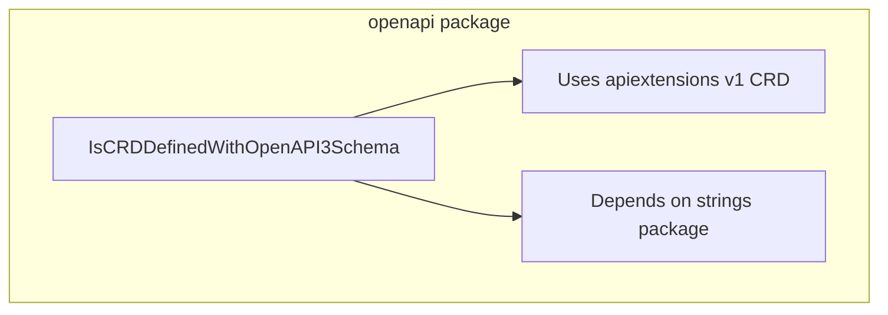

IsCRDDefinedWithOpenAPI3Schema`

| Item | Detail |
|------|--------|
| **Package** | `openapi` (`github.com/redhat-best-practices-for-k8s/certsuite/tests/operator/openapi`) |
| **Signature** | `func (*apiextv1.CustomResourceDefinition) bool` |
| **Exported** | Yes – can be used by other test packages. |

### Purpose
The function determines whether a given Kubernetes Custom Resource Definition (CRD) contains an OpenAPI v3 schema in its specification.  
In the certsuite test suite this is needed to verify that operator CRDs expose proper validation schemas before further tests are run.

### Parameters
* `crd *apiextv1.CustomResourceDefinition` – a pointer to the CRD object obtained from the API server or loaded from YAML.  
  The function does **not** modify the struct; it only inspects fields.

### Return value
* `bool` – `true` if the CRD has an OpenAPI v3 schema defined, otherwise `false`.

### Core logic (high‑level)
1. Inspect the `crd.Spec.Validation.OpenAPIV3Schema` field.
2. Convert the schema’s JSON representation to a string (`String()`).
3. Search that string for the literal `"openapi: 3."`.  
   The search is case‑insensitive by converting both the source and the pattern to lower case with `strings.ToLower`.
4. Return `true` if the pattern is found, indicating an OpenAPI v3 schema is present.

### Dependencies
* **Kubernetes API** – uses `apiextv1.CustomResourceDefinition` from `k8s.io/apiextensions-apiserver/pkg/apis/apiextensions/v1`.
* **Standard library** – `strings.String`, `strings.Contains`, `strings.ToLower`.

No global variables or other package state are touched.

### Side effects
None. The function is pure: it only reads from the input CRD and returns a boolean. It can be safely called concurrently.

### How it fits the package
The `openapi` test package contains utilities for validating that operator CRDs expose proper OpenAPI schemas.  
`IsCRDDefinedWithOpenAPI3Schema` is a helper used by higher‑level tests to gate further validation logic, ensuring they only run against CRDs that advertise an OpenAPI v3 schema.

---

#### Suggested Mermaid diagram (for package structure)

This diagram shows the function’s place within the package and its key dependencies.
