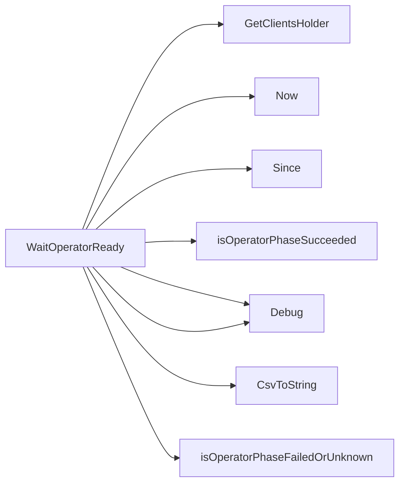

## Package phasecheck (github.com/redhat-best-practices-for-k8s/certsuite/tests/operator/phasecheck)

# PhaseCheck Package Overview  
*Location:* `github.com/redhat-best-practices-for-k8s/certsuite/tests/operator/phasecheck`  

The **phasecheck** package contains logic for waiting until an Operator’s ClusterServiceVersion (CSV) reaches a terminal state (either *Succeeded*, *Failed*, or *Unknown*). It is used by the certsuite test suite to assert that Operators become ready before proceeding with further tests.

---

## Key Components

| Element | Type | Purpose |
|---------|------|---------|
| `timeout` | `time.Duration` | Default wait time (1 minute) for an Operator to finish installing. |
| `WaitOperatorReady(csv *v1alpha1.ClusterServiceVersion) bool` | exported function | Core helper that polls the CSV until it reports a terminal phase or times out. Returns `true` if succeeded, otherwise `false`. |
| `isOperatorPhaseSucceeded(csv *v1alpha1.ClusterServiceVersion) bool` | unexported helper | Checks if `csv.Status.Phase == "Succeeded"`. Logs debug info. |
| `isOperatorPhaseFailedOrUnknown(csv *v1alpha1.ClusterServiceVersion) bool` | unexported helper | Checks for `"Failed"` or `"Unknown"` phases. Logs debug info. |

---

## How It Works

```mermaid
flowchart TD
    A[Call WaitOperatorReady(csv)] --> B{Start timer}
    B --> C[Poll CSV every 5s]
    C --> D{Phase succeeded?}
    D -- yes --> E[Return true]
    D -- no --> F{Phase failed/unknown?}
    F -- yes --> G[Log & Return false]
    F -- no --> H{Timeout reached?}
    H -- yes --> I[Return false]
    H -- no --> C
```

1. **Timer** – The function records the start time and calculates a deadline (`start + timeout`).
2. **Polling Loop** – Every 5 seconds it:
   - Retrieves the current CSV from the cluster.
   - Logs the CSV status via `CsvToString`.
3. **State Checks**
   - If `isOperatorPhaseSucceeded` returns `true`, the operator is ready → function returns `true`.
   - If `isOperatorPhaseFailedOrUnknown` returns `true`, installation failed → logs error and returns `false`.
4. **Timeout** – If the deadline passes without a terminal phase, it reports an error and returns `false`.

The package relies on the following helpers (imported from other internal packages):

- `clientsholder.GetClientsHolder()` – provides Kubernetes client interfaces.
- `log.Debug(...)` / `log.Error(...)` – structured logging.
- `CsvToString(csv)` – pretty‑prints a CSV for debugging.

---

## Usage Pattern

```go
// In a test case:
csv := &v1alpha1.ClusterServiceVersion{ /* name, namespace */ }
if !phasecheck.WaitOperatorReady(csv) {
    t.Fatalf("operator did not become ready in time")
}
```

The test harness can pass the CSV that was just installed or fetch it by name/namespace. `WaitOperatorReady` encapsulates all retry logic so callers need only handle a simple boolean result.

---

## Summary

* **Purpose:** Provide a reliable, timeout‑bounded check for Operator readiness.
* **Key flow:** Poll CSV → check phase → return success/failure.
* **Extensibility:** Adding new terminal states would involve updating the two helper predicates.  
This design keeps test code concise while ensuring Operators are fully operational before further verification steps.

### Functions

- **WaitOperatorReady** — func(*v1alpha1.ClusterServiceVersion)(bool)

### Call graph (exported symbols, partial)



### Symbol docs

- [function WaitOperatorReady](symbols/function_WaitOperatorReady.md)
