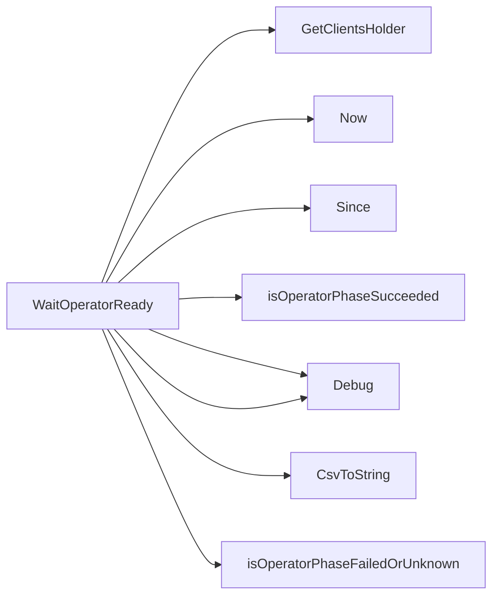

## Package phasecheck (github.com/redhat-best-practices-for-k8s/certsuite/tests/operator/phasecheck)

### Functions

- **WaitOperatorReady** — func(*v1alpha1.ClusterServiceVersion)(bool)

### Call graph (exported symbols, partial)

### Symbol docs

- [function WaitOperatorReady](symbols/function_WaitOperatorReady.md)
