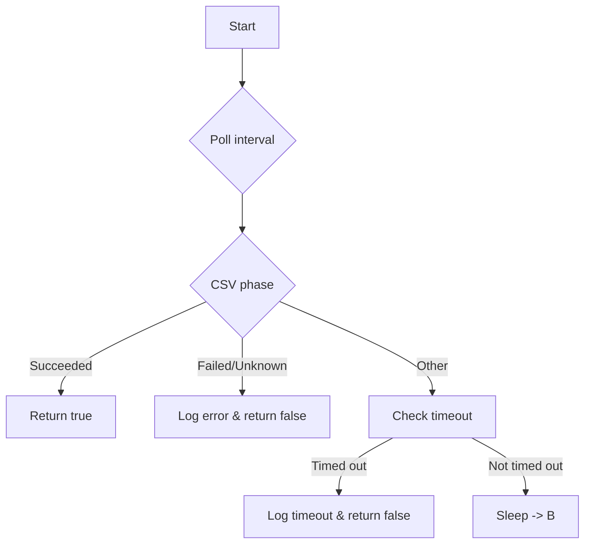

WaitOperatorReady`

| Feature | Details |
|---------|---------|
| **Package** | `phasecheck` (`github.com/redhat-best-practices-for-k8s/certsuite/tests/operator/phasecheck`) |
| **Signature** | `func WaitOperatorReady(csv *v1alpha1.ClusterServiceVersion) bool` |
| **Exported?** | Yes |

### Purpose
`WaitOperatorReady` is a helper used in the operator test suite to block until an Operator’s ClusterServiceVersion (CSV) reaches a stable, usable state.  
It polls the CSV status in intervals of `timeout/10` seconds and returns once one of the following conditions holds:

1. **Success** – The CSV phase is `"Succeeded"`.  
2. **Failure / Unknown** – The CSV phase becomes `"Failed"` or `"Unknown"`, causing an immediate failure report.
3. **Timeout** – The operation has been polling for longer than `timeout` (a constant defined in the same file). In this case, the function logs the current status and returns `false`.

The returned boolean is a simple indicator:  
*`true`*  → CSV succeeded before timeout.  
*`false`* → Timeout or failure detected.

### Inputs & Outputs

| Parameter | Type | Description |
|-----------|------|-------------|
| `csv` | `*v1alpha1.ClusterServiceVersion` | The target CSV object that is being monitored. |

| Return value | Type | Meaning |
|--------------|------|---------|
| `bool` | Indicates whether the operator became ready (`true`) or not (`false`). |

### Key Dependencies

| Dependency | Role |
|------------|------|
| `GetClientsHolder()` | Provides a Kubernetes client capable of reading CSV objects. |
| `Now()`, `Since()` | Time helpers used to compute elapsed time and enforce timeout. |
| `isOperatorPhaseSucceeded(csv)` | Checks if the CSV’s status phase is `"Succeeded"`. |
| `isOperatorPhaseFailedOrUnknown(csv)` | Detects failure or unknown phases, triggering error logs. |
| `Debug(msg, ...)` | Emits diagnostic logs for each polling iteration. |
| `CsvToString(csv)` | Serialises a CSV to a human‑readable string for logging. |
| `Sleep(duration)` | Pauses between polls. |
| `Get(...)`, `ClusterServiceVersions()`, `OperatorsV1alpha1()` | Low‑level Kubernetes API calls to fetch the latest CSV state. |
| `TODO()` / `Error(msg, ...)` | Error handling utilities that log failures and abort when necessary. |

### Side Effects

* **Logs** – Extensive debug output is produced each poll cycle, including current CSV status.
* **Kubernetes Calls** – Performs a GET request on the CSV resource at every interval.
* **Blocking** – The function blocks the caller until success, failure, or timeout occurs.

### How It Fits Into the Package

The `phasecheck` package contains utilities for validating operator phases during integration tests.  
`WaitOperatorReady` is typically invoked after installing an Operator to ensure that its CSV reaches a `"Succeeded"` state before proceeding with further test steps.  
By encapsulating polling logic and timeout handling, it simplifies test code and guarantees consistent behaviour across different Operator deployments.

---

#### Suggested Mermaid Diagram (optional)

This diagram illustrates the decision tree inside `WaitOperatorReady`.
