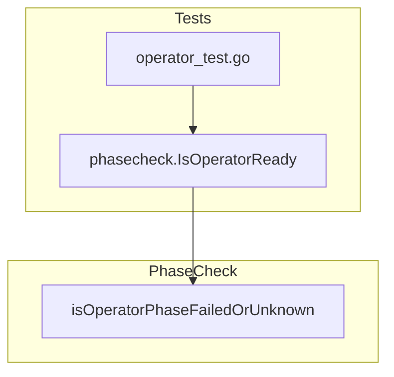

isOperatorPhaseFailedOrUnknown`

```go
func isOperatorPhaseFailedOrUnknown(c *v1alpha1.ClusterServiceVersion) bool
```

## Purpose

Determines whether a **Cluster Service Version (CSV)** is in a terminal or indeterminate state that should be treated as a failure for the test harness.  
The function is used by the `phasecheck` package to decide if an operator deployment should be considered broken and trigger cleanup/re‑run logic.

---

## Parameters

| Name | Type | Description |
|------|------|-------------|
| `c`  | `*v1alpha1.ClusterServiceVersion` | Pointer to a CSV object fetched from the cluster. It is expected that this object has been retrieved with all relevant status fields populated. |

> **Note**: The package imports `k8s.io/api/operator/v1alpha1` (or a vendored equivalent) for the `ClusterServiceVersion` type.

---

## Return Value

| Type | Meaning |
|------|---------|
| `bool` | *`true`* if the CSV is in **Failed** or **Unknown** phase, otherwise *false*. |

The boolean directly informs callers whether to abort further checks on this operator instance.

---

## Implementation Details

1. **Phase extraction**  
   The function reads `c.Status.Phase`, a string describing the CSV lifecycle state (`"Succeeded"`, `"Failed"`, `"Unknown"`, etc.).

2. **Decision logic**  
   ```go
   phase := c.Status.Phase
   if phase == "Failed" || phase == "Unknown" {
       return true
   }
   return false
   ```

3. **Debug Logging**  
   The function invokes `log.Debug` (or a similar logger provided by the test framework) to emit the current phase for diagnostic purposes:
   ```go
   log.Debug("CSV phase:", phase)
   ```
   This side‑effect does not alter any state but aids troubleshooting.

---

## Dependencies

| Dependency | Role |
|------------|------|
| `log.Debug` (from the package’s logger) | Emits diagnostic messages about the CSV phase. |

No external services or global variables are used; the function is pure except for the logging side‑effect.

---

## How It Fits the Package

The `phasecheck` package contains helpers that validate operator readiness by inspecting CSV status fields.  
- `isOperatorPhaseFailedOrUnknown` is a low‑level predicate called by higher‑level functions such as `IsOperatorReady()` or test harness logic.  
- By isolating this check, the package keeps phase comparison logic in one place, simplifying maintenance and unit testing.



---

### Summary

`isOperatorPhaseFailedOrUnknown` is a small, focused helper that inspects the `ClusterServiceVersion.Status.Phase` field and reports whether the operator is in a failed or unknown state. It logs this information for debugging and returns a boolean used by higher‑level readiness checks within the test suite.
