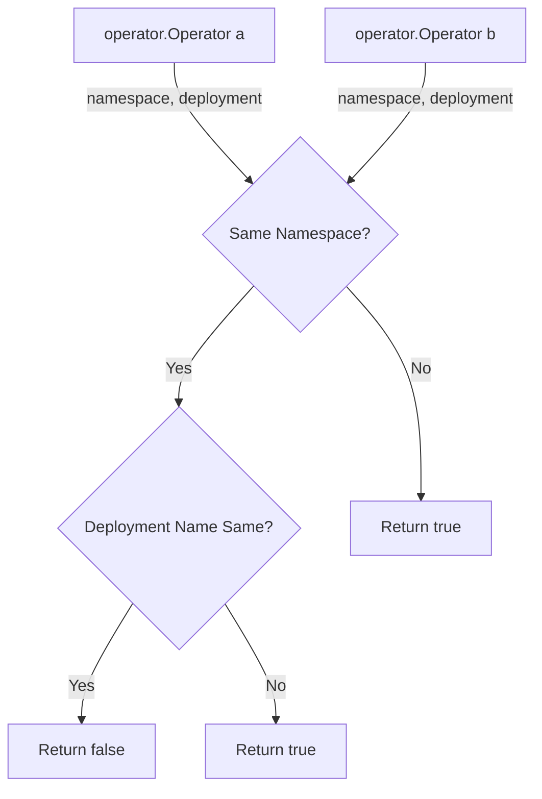

OperatorInstalledMoreThanOnce`

**Location**  
`github.com/redhat-best-practices-for-k8s/certsuite/tests/operator/helper.go:58`

### Purpose
`OperatorInstalledMoreThanOnce` is a helper used by the operator test suite to determine whether two instances of an operator are *identical* or represent *two distinct installations*.  
In practice, the function compares the two `provider.Operator` objects that were discovered during the test run and returns `true` if they appear to be different installations (e.g., installed in separate namespaces or with different deployment names).

### Signature
```go
func OperatorInstalledMoreThanOnce(a, b *provider.Operator) bool
```

| Parameter | Type                | Description                               |
|-----------|---------------------|-------------------------------------------|
| `a`       | `*provider.Operator` | First operator instance discovered.        |
| `b`       | `*provider.Operator` | Second operator instance discovered.       |

**Return value**  
`bool`:  
- `true`  – the two operators are considered *different installations*.  
- `false` – they represent the same installation (same namespace & deployment name).

### Key Dependencies
| Dependency | Role in Function |
|------------|------------------|
| `Debug`, `Error` | Logging messages to aid test diagnostics. |
| `String` (from `fmt`) | String conversion of operator fields for comparison and logging. |
| `TrimSuffix` (strings package) | Normalises deployment names by removing the trailing “‑operator” suffix before comparison. |

### Core Logic
1. **Early exit** – If either pointer is `nil`, log an error and return `false`.  
2. **Namespace comparison** – Operators must be in the same namespace to be considered the same installation. A mismatch logs a debug message and returns `true`.
3. **Deployment name comparison** – Deployment names are compared after stripping any trailing “‑operator” suffixes (to handle cases where different operators share similar base names).  
   * If they differ, log a debug message and return `true`.  
   * If they match, log that the operator appears to be installed only once and return `false`.

### Side Effects
- Emits debug and error logs via the test environment’s logger; these are side‑effects but are harmless as they do not modify any state.
- No modification of the `provider.Operator` instances.

### Package Context
This helper belongs to the **operator** test package (`github.com/redhat-best-practices-for-k8s/certsuite/tests/operator`).  
It is used by higher‑level tests that discover operator deployments (via `env.FindOperators()`) and need to assert that only one instance of a particular operator is present in the cluster.

### Mermaid Diagram (optional)


This diagram illustrates the decision tree used by `OperatorInstalledMoreThanOnce`.
