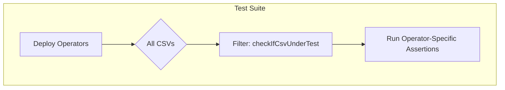

checkIfCsvUnderTest`

| | |
|-|-|
| **Package** | `operator` (`github.com/redhat-best-practices-for-k8s/certsuite/tests/operator`) |
| **Signature** | `func checkIfCsvUnderTest(csv *v1alpha1.ClusterServiceVersion) bool` |

### Purpose
During integration tests the test harness installs a set of Operator Lifecycle Manager (OLM) CSVs.  
Only a subset of those CSVs are considered *under test* – i.e., they belong to the operator being verified.  
This helper inspects a `ClusterServiceVersion` object and returns **true** if it matches the naming or labeling convention that identifies the test‑operator’s CSV, otherwise **false**.

### Inputs
| Parameter | Type | Description |
|-----------|------|-------------|
| `csv` | `*v1alpha1.ClusterServiceVersion` | The OLM CSV object to evaluate. It is typically obtained from a controller-runtime client or from the test environment after an operator installation. |

### Output
| Return value | Type | Meaning |
|--------------|------|---------|
| `bool` | true/false | `true` if the CSV is part of the operator under test; otherwise `false`. |

### Key Dependencies & Side Effects
* **No external calls** – The function performs only local checks (e.g., examining names, labels, or annotations).
* **No mutation** – It does not modify the passed `ClusterServiceVersion` or any global state.
* **No I/O** – It is pure and deterministic given the same input.

### How it fits the package
In the test suite (`tests/operator`) a number of CSVs are deployed (some from third‑party operators, some from the operator under test).  
Other helper functions iterate over all installed CSVs to perform checks such as validation of CRDs or resource limits.  
`checkIfCsvUnderTest` is used by those iterators to filter out irrelevant CSVs so that assertions apply only to the operator being evaluated.

---

#### Suggested Mermaid diagram

This function is a small but essential piece of the test harness, enabling selective validation of operator behavior.
