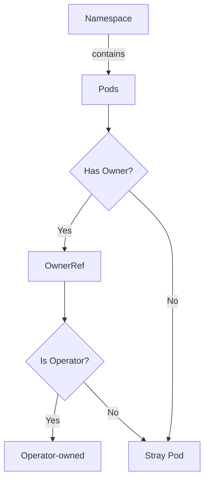

findPodsNotBelongingToOperators`

| Feature | Detail |
|---------|--------|
| **File** | `tests/operator/helper.go` (line 187) |
| **Visibility** | Unexported – used only within the *operator* test suite |
| **Signature** | `func findPodsNotBelongingToOperators(namespace string) ([]string, error)` |

## Purpose
The helper scans a given Kubernetes namespace and returns the names of all pods that are **not owned by any Operator**.  
In the CertSuite test harness this is used to validate that the operator’s reconciliation loop has not left stray pods behind after performing actions such as upgrading or deleting custom resources.

> **Why “operator”?**  
Operators in Kubernetes are typically represented by a Deployment, DaemonSet, StatefulSet, etc., and each pod created by an Operator should have its *owner reference* pointing to that controller. Any pod lacking such a reference is considered orphaned from the operator’s perspective.

## Parameters
| Name | Type | Meaning |
|------|------|---------|
| `namespace` | `string` | The Kubernetes namespace to inspect (e.g., `"cert-manager"`). |

## Returns
| Value | Type | Description |
|-------|------|-------------|
| `[]string` | slice of pod names | All pods in the given namespace that are **not** owned by an operator. |
| `error` | error | Non‑nil if any API call fails (e.g., listing pods or retrieving owner information). |

## Key Dependencies
| Dependency | Role |
|------------|------|
| `getAllPodsBy(namespace)` | Retrieves all pod objects in the namespace. The implementation is hidden in the same package; it likely wraps a Kubernetes client `List` operation filtered by namespace. |
| `GetPodTopOwner(pod)` | Examines a pod’s owner references and returns the *top‑level* owning object (Deployment, ReplicaSet, etc.). If no owner exists or the top owner is not an Operator, this function returns `nil`. |
| `append` | Standard Go built‑in used to collect non‑operator pods into the result slice. |

## Algorithm
1. **List Pods** – Call `getAllPodsBy(namespace)` to obtain every pod in the target namespace.
2. **Inspect Ownership** – For each pod:
   * Use `GetPodTopOwner(pod)` to fetch its top‑level owner reference.
   * If the returned owner is `nil` (no owner) or the owner’s kind does not correspond to an Operator controller, treat the pod as stray.
3. **Collect Names** – Append the pod’s name to a slice of results.
4. **Return** – After iterating all pods, return the slice and any error encountered during listing.

## Side‑Effects
* The function performs read‑only operations against the Kubernetes API; it does not modify cluster state.
* It may block until the API responses are received or an error occurs.

## Integration with the Package
Within the `operator` test suite:

```go
// Example usage in a test case
strayPods, err := findPodsNotBelongingToOperators("cert-manager")
if err != nil { t.Fatal(err) }
assert.Empty(t, strayPods)
```

The helper is part of the **helper** file that houses various utilities for operator tests (e.g., waiting for resources, checking status). It supports assertions that the operator cleans up its pods correctly after operations such as upgrades or deletions.

## Suggested Mermaid Diagram



This diagram illustrates how each pod is evaluated: only those without an operator owner are flagged as stray.
