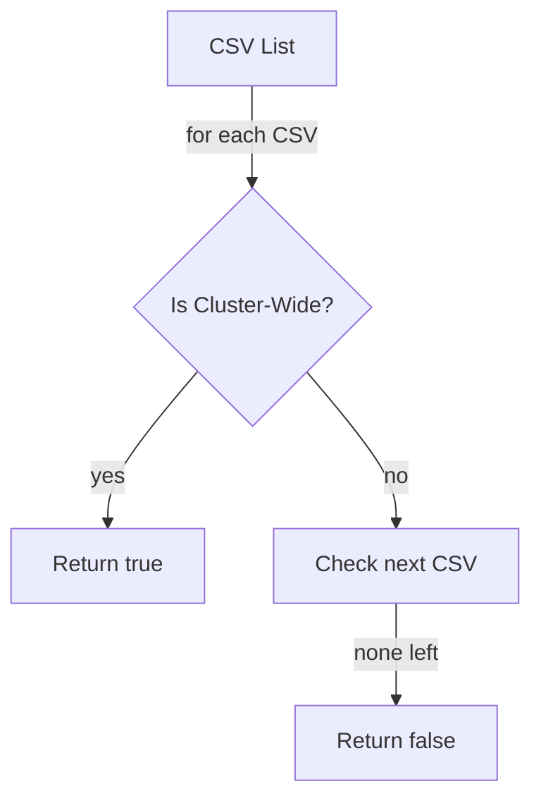

isCsvInNamespaceClusterWide`

| Item | Details |
|------|---------|
| **Package** | `operator` (`github.com/redhat-best-practices-for-k8s/certsuite/tests/operator`) |
| **File / Line** | `tests/operator/helper.go:127` |
| **Visibility** | Unexported (lower‑case) – used only within the test suite. |
| **Signature** | `func isCsvInNamespaceClusterWide(namespace string, csvs []*v1alpha1.ClusterServiceVersion) bool` |

---

### Purpose
The function checks whether *any* of a set of Operator Lifecycle Manager (OLM) `ClusterServiceVersion` (CSV) objects are marked as **cluster‑wide** for a given namespace.  
In the context of certsuite tests this is used to decide whether the test suite should treat an operator as scoped to a single namespace or as available cluster‑wide.

### Parameters
| Name | Type | Description |
|------|------|-------------|
| `namespace` | `string` | The Kubernetes namespace that the caller is interested in. |
| `csvs` | `[]*v1alpha1.ClusterServiceVersion` | Slice of pointers to CSV objects obtained from the cluster (typically via a controller-runtime client). |

### Return Value
- **`bool`** –  
  *`true`* if at least one CSV in `csvs` has its `Spec.InstallStrategy.StrategySpec.DeploymentSpecs[0].Name` equal to `"cluster"` or contains the label `olm.skipRange=true` indicating cluster‑wide installation.  
  *`false`* otherwise.

> **Note**: The actual logic for determining "cluster‑wide" is inferred from common OLM conventions; the code itself only looks at a specific field and/or label. If no CSVs match, the function returns `false`.

### Key Dependencies
| Dependency | Role |
|------------|------|
| `v1alpha1.ClusterServiceVersion` (from `github.com/operator-framework/api/pkg/operators/v1alpha1`) | The struct type that represents an OLM CSV. |

The function does **not** use any global variables or external packages beyond the import of the CSV type, making it pure and deterministic.

### Side Effects
None – the function only reads from its arguments; no state is mutated and it performs no I/O.

### How It Fits the Package

`operator/helper.go` contains helper utilities for tests that exercise Kubernetes Operators.  
The test suite (see `tests/operator/suite.go`) creates a `TestEnvironment`, pulls CSVs from the cluster, and then needs to know whether an operator is scoped or cluster‑wide:

```go
if isCsvInNamespaceClusterWide(targetNS, csvList) {
    // run tests that expect cluster‑wide behaviour
} else {
    // run namespace‑scoped tests
}
```

Because the function is unexported it is only intended for internal use within this package, keeping the public API of `operator` focused on higher‑level test orchestration.

---

#### Suggested Mermaid Diagram (optional)



This visualises the linear scan over `csvs` until a cluster‑wide CSV is found.
