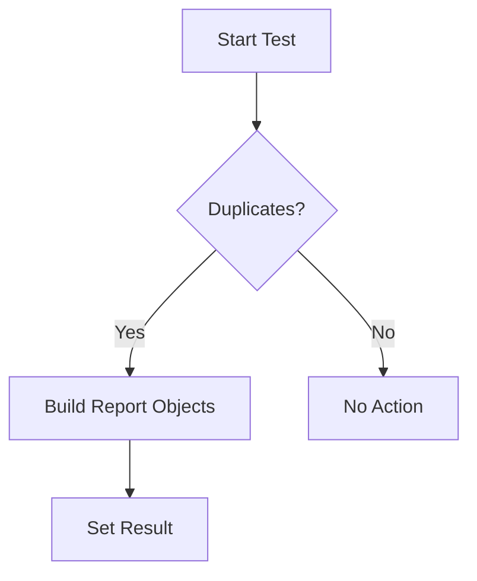

testMultipleSameOperators`

**File:** `tests/operator/suite.go` – line 437  
**Package:** `operator`

---

## Purpose
`testMultipleSameOperators` is a test helper that verifies the behaviour of a Kubernetes operator when **multiple instances of the same operator are installed** in the cluster.  
It collects diagnostic information, builds a report object for each detected duplicate instance, and records the test result.

---

## Signature

```go
func (*checksdb.Check, *provider.TestEnvironment)()
```

| Parameter | Type                           | Description |
|-----------|--------------------------------|-------------|
| `c`       | `*checksdb.Check`              | The current check context (used only for logging). |
| `env`     | `*provider.TestEnvironment`    | Test environment, providing access to cluster state and reporting utilities. |

The function returns nothing; it performs side‑effects by updating the report attached to the provided environment.

---

## Key Steps & Dependencies

1. **Logging**  
   * `LogInfo(c)` – emits high‑level info about the test start.  
   * `LogDebug(c, ...)` – two debug logs for internal state inspection.

2. **Duplicate Detection**  
   * Calls `OperatorInstalledMoreThanOnce(env)` which returns a slice of duplicate operator objects (type unknown from the snippet).  
   * The length of this slice is logged via `len()`.

3. **Report Construction**  
   For each duplicate found, two separate report objects are created:
   ```go
   obj := NewOperatorReportObject(...)
   ```
   Each object is appended to a local slice using `append`.

4. **Result Setting**  
   * After processing all duplicates, the function calls `SetResult(obj)` on the test environment to persist the findings.

---

## Side Effects

- Populates the `TestEnvironment`’s internal report with details about each duplicate operator.
- Emits log entries that may appear in the test output or external logging system.
- Does **not** modify the cluster state; it only reads information and records results.

---

## Integration within the Package

The `operator` package implements a suite of tests for Kubernetes operators.  
`testMultipleSameOperators` is one of many check functions invoked by the test harness (likely via a table‑driven approach).  
Its role is to ensure that installing more than one instance of an operator does not go unnoticed, contributing to overall operator reliability checks.

---

## Suggested Mermaid Diagram



This diagram visualises the decision path: if duplicates exist, reports are built and stored; otherwise nothing is done.
