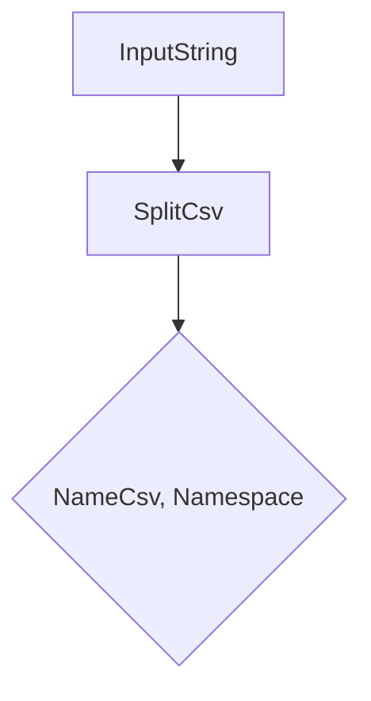

CsvResult` – Operator Test Helper

**Location**

```go
// File: tests/operator/helper.go
package operator
```

---

## Purpose

`CsvResult` is a lightweight container used by the test‑helper function `SplitCsv`.  
It captures the two parts that are extracted from an input string representing a CSV (ClusterServiceVersion) reference:

| Field | Description |
|-------|-------------|
| **NameCsv**   | The name of the CSV, e.g. `"my-operator.v1.0.0"`. |
| **Namespace** | The namespace where the CSV should be installed, e.g. `"operators"` (empty if omitted). |

The struct is exported so that callers outside this package can inspect the parsed values.

---

## Usage Flow

```go
func SplitCsv(input string) CsvResult {
    // ... parsing logic ...
    return CsvResult{NameCsv: name, Namespace: ns}
}
```

1. **Input** – a single string (`input`) containing an optional namespace prefix (e.g., `"operators/my-operator.v1.0.0"`).  
2. **Processing** – `SplitCsv` trims whitespace, checks for the `"namespace/"` prefix, splits on `/`, and returns the parts in a `CsvResult`.  
3. **Output** – a `CsvResult` instance with populated fields.

The returned struct is immutable from the caller’s perspective; no methods modify it after construction.

---

## Key Dependencies

| Dependency | Role |
|------------|------|
| `strings.Split`, `TrimSpace`, `HasPrefix`, `TrimPrefix` | Standard library functions used in `SplitCsv` to parse the input string. |

No external packages or global state are touched by `CsvResult`; it is purely a data holder.

---

## Side Effects

None.  
Creating or returning a `CsvResult` does not alter any global variables, modify files, or perform I/O.

---

## Diagram (optional)



---

### Summary

- **Struct**: `CsvResult`
- **Fields**: `NameCsv`, `Namespace` (both strings)
- **Role**: Holds the parsed name and namespace from a CSV reference.
- **Context**: Used exclusively by `SplitCsv` in the operator test helpers.
