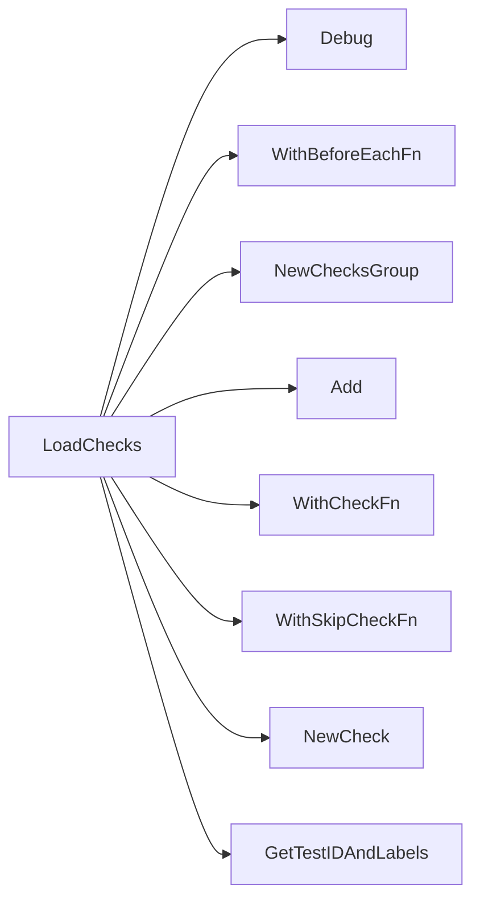

## Package performance (github.com/redhat-best-practices-for-k8s/certsuite/tests/performance)

# Performance Test Suite – Overview

The **performance** package implements a set of checks that validate the CPU‑related configuration and runtime behaviour of pods in a Kubernetes cluster.  
All logic lives in `suite.go`; the file is intentionally read‑only for this documentation.

---

## 1. Global State

| Variable | Type | Purpose |
|----------|------|---------|
| `env` | `provider.TestEnvironment` | Holds the test harness context (k8s client, logger, etc.). It is initialized in the test suite’s `BeforeEach` hook. |
| `beforeEachFn` | *function* | A wrapper that runs before each check; it logs the start of a check and sets up any required state. |
| `skipIfNoGuaranteedPodContainersWithExclusiveCPUs`, `skipIfNoGuaranteedPodContainersWithExclusiveCPUsWithoutHostPID`, `skipIfNoGuaranteedPodContainersWithIsolatedCPUsWithoutHostPID`, `skipIfNoNonGuaranteedPodContainersWithoutHostPID` | *function* | Helper skip‑functions that return a bool/err. They are attached to checks that only make sense when particular pod/container patterns exist. |

### Constants

| Name | Value | Meaning |
|------|-------|---------|
| `maxNumberOfExecProbes` | 5 | Upper bound on allowed exec probes per container. |
| `minExecProbePeriodSeconds` | 10 | Minimum period between consecutive exec probe invocations. |
| `noProcessFoundErrMsg` | `"no process found"` | Standard error string used when a probe’s command yields no running process. |

---

## 2. Core Functions

### `LoadChecks()`

*Signature*: `func()()`  
*Role*: Registers all performance checks with the test framework.

1. **Setup** – logs “Loading performance checks”, attaches the common `beforeEachFn` to each check, and sets skip‑functions for the four categories of pod patterns.
2. **Check groups** – creates three `ChecksGroup`s:
   * **CPU pool usage** – validates exclusive / isolated CPU allocations.
   * **Exec probe limits** – ensures containers do not exceed `maxNumberOfExecProbes` or run probes too frequently (`minExecProbePeriodSeconds`).
   * **Real‑time (RT) apps** – checks that RT pods have no exec probes and their processes are correctly scheduled.

Each group contains one or more checks created via `NewCheck`, with a unique ID, description, and a function pointer (e.g., `testExclusiveCPUPool`). The check’s `WithSkipCheckFn` references the appropriate skip helper.

---

### `filterProbeProcesses(procs []*crclient.Process, cont *provider.Container) ([]*crclient.Process, []*testhelper.ReportObject)`

Used by **RT app** checks.  
It:

1. Builds a map of exec‑probe commands for the container (`getExecProbesCmds`).
2. Iterates over all processes in the pod.
3. Keeps only those whose command matches an exec probe and are *not* already known (to avoid duplicates).
4. Generates `ReportObject`s for each matched process, adding fields such as PID, namespace, CPU scheduling policy, etc.

---

### `getExecProbesCmds(cont *provider.Container) map[string]bool`

Parses a container’s pod spec to extract the full command string of every exec probe.  
The returned map is used by `filterProbeProcesses` to quickly test membership (`Contains`).  

---

## 3. Individual Check Implementations

| Check | Function | Key Steps |
|-------|----------|-----------|
| **Exclusive CPU pool** (`testExclusiveCPUPool`) | Checks that containers with exclusive CPUs have the expected scheduling and no host PID. | *For each container* – verifies `HasExclusiveCPUsAssigned`, logs details, creates a pod report object, sets result status. |
| **Limited use of exec probes** (`testLimitedUseOfExecProbes`) | Ensures no more than 5 exec probes per container and that they run at least 10 s apart. | *Iterate containers* – count probes, compute time gaps, log errors if limits breached, set result accordingly. |
| **RT apps no exec probes** (`testRtAppsNoExecProbes`) | For non‑guaranteed pods without host PID, verifies that RT containers have zero exec probes and their processes are scheduled on the right CPUs. | *For each container* – collect processes, filter probe processes, evaluate scheduling policy (RT vs normal), log warnings/errors, set result. |
| **Scheduling policy in CPU pool** (`testSchedulingPolicyInCPUPool`) | For guaranteed pods with exclusive or isolated CPUs, checks that the processes inside share a PID namespace and run on the correct CPUs. | *For each container* – get PIDs from its namespace, evaluate CPU scheduling of those PIDs, log debug info, set result. |

All checks use the `log` helper (`GetLogger`) to emit structured logs (fields like `container`, `pod`, `result`). Report objects are created via helpers in `testhelper`:  
* `NewPodReportObject` – for pod‑level reports.  
* `NewContainerReportObject` – for container‑level reports.  
* `NewReportObject` – generic report object.

---

## 4. Flow Diagram (suggested Mermaid)

```mermaid
flowchart TD
    A[LoadChecks] --> B{Create Groups}
    B --> C[CPU pool checks]
    B --> D[Exec probe checks]
    B --> E[RT app checks]

    subgraph CPU Pool Checks
        F[TestExclusiveCPUPool] --> G[Check exclusive CPUs]
        H[TestSchedulingPolicyInCPUPool] --> I[Validate PID namespace & CPU policy]
    end

    subgraph Exec Probe Checks
        J[TestLimitedUseOfExecProbes] --> K[Count probes, check period]
    end

    subgraph RT App Checks
        L[TestRtAppsNoExecProbes] --> M[Filter probe processes]
        M --> N[Validate scheduling policy (RT)]
    end

    style A fill:#f9f,stroke:#333,stroke-width:2px
```

---

## 5. How It All Connects

1. **Test harness** creates a `provider.TestEnvironment` (`env`) and passes it to each check.
2. `LoadChecks` registers checks with the framework; each check is wrapped by `beforeEachFn` for logging.
3. Checks use helper functions from:
   * `checksdb` – provides metadata (IDs, labels).
   * `provider` – exposes pod/container data (`GetContainerProcesses`, scheduling info).
   * `crclient` – low‑level process inspection on the node.
   * `testhelper` – report object construction and result handling.
4. Skip functions guard checks that would be meaningless if required pods are absent, improving test stability.

---

### Unknowns

* The exact implementation of the helper skip functions (`skipIfNo…`) is not shown in this file; they likely query the environment for matching pod patterns.
* The internal structure of `testhelper.ReportObject` and how results propagate to the final test report is not visible here.

### Functions

- **LoadChecks** — func()()

### Globals


### Call graph (exported symbols, partial)



### Symbol docs

- [function LoadChecks](symbols/function_LoadChecks.md)
