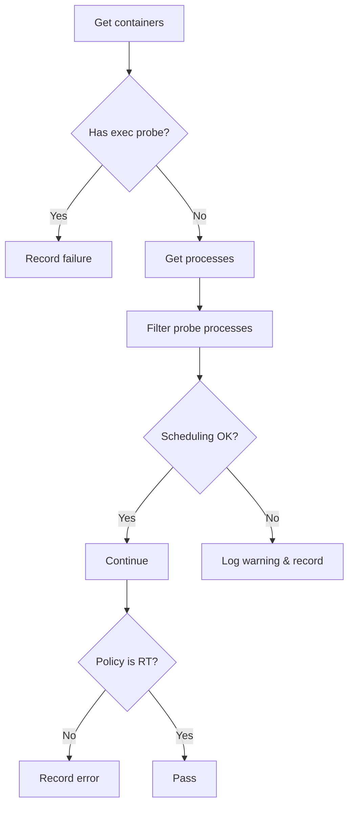

testRtAppsNoExecProbes`

| Item | Detail |
|------|--------|
| **Package** | `performance` (github.com/redhat-best-practices-for-k8s/certsuite/tests/performance) |
| **Signature** | `func(*checksdb.Check, *provider.TestEnvironment)` |
| **Exported?** | No – internal helper used by the test suite. |

### Purpose
Validates that **real‑time (RT) applications** running in non‑guaranteed pods without `hostPID` are not configured with exec probes.

Exec probes (`execAction`) can trigger additional processes that may interfere with the deterministic scheduling RT workloads rely on.  
The function iterates over all relevant containers, checks for the presence of exec probes, and records any violations as part of the test report.

### Inputs
| Parameter | Type | Role |
|-----------|------|------|
| `c` | `*checksdb.Check` | The check instance that holds the result structure to be populated. |
| `env` | `*provider.TestEnvironment` | Test environment providing access to cluster information (e.g., pod listings). |

### Workflow
1. **Container discovery**  
   * Calls `GetNonGuaranteedPodContainersWithoutHostPID(env)` to fetch all containers in non‑guaranteed pods that do not run with the host PID namespace.

2. **Exec probe detection**  
   * For each container, it logs the probe configuration via `LogInfo`.  
   * If `HasExecProbes(container)` returns true, a violation is recorded:
     ```go
     c.AddField("container", container.Name).AddField("execProbe", "found").SetResult(checksdb.Failed)
     ```

3. **Process validation** (executed only if no exec probes were found)  
   * Retrieves the processes spawned by the container with `GetContainerProcesses(container)`; errors are logged with `LogError`.  
   * Filters out known probe‑related processes using `filterProbeProcesses(processes, env.Namespace)`.  
   * For each remaining process, it obtains CPU scheduling info (`GetProcessCPUScheduling`) and checks that the scheduling class is `SCHED_FIFO` or `SCHED_RR`.  
   * Any mismatch triggers a warning (`LogWarn`) and records an additional report entry.

4. **RT policy verification**  
   * Checks whether the container’s pod policy is marked as RT via `PolicyIsRT(container)`.  
   * If not, logs an error and appends a failure record for that container.

5. **Result aggregation**  
   * After processing all containers, the check’s overall result is set to `checksdb.Passed` if no failures were recorded; otherwise it remains failed.

### Key Dependencies
| Dependency | Role |
|------------|------|
| `GetNonGuaranteedPodContainersWithoutHostPID` | Enumerates target containers. |
| `HasExecProbes`, `GetContainerProcesses`, `filterProbeProcesses`, `GetProcessCPUScheduling` | Inspect container runtime state and processes. |
| `PolicyIsRT` | Determines if a pod is intended to run RT workloads. |
| Logging helpers (`LogInfo`, `LogError`, `LogWarn`) | Provide visibility during test execution. |

### Side Effects
* No modification of cluster state – purely read‑only.
* Emits log entries for debugging and creates structured report objects in the supplied `Check`.
* The function may call `c.SetResult` to mark the overall pass/fail status.

### Integration with the Test Suite
`testRtAppsNoExecProbes` is invoked by a higher‑level test that runs after environment setup.  
It relies on global flags such as `skipIfNoNonGuaranteedPodContainersWithoutHostPID` to determine whether the test should run at all.  
Its outcome contributes to the overall performance compliance assessment for RT workloads.

---

#### Suggested Mermaid diagram (overview)



This function is a core validator ensuring that RT applications remain free of exec probes and run with the correct CPU scheduling, preserving their deterministic behavior.
