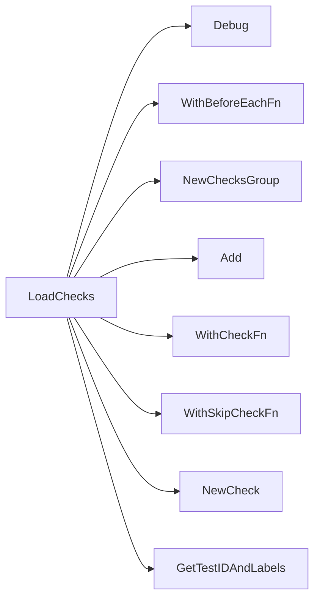

## Package platform (github.com/redhat-best-practices-for-k8s/certsuite/tests/platform)

# Platform Test Suite – High‑Level Overview

The **`platform`** package implements the platform‑level test suite for CertSuite.  
It registers a large number of checks that run against an OpenShift/K8s cluster to verify
operating‑system, node configuration, and infrastructure health.

| Item | Description |
|------|-------------|
| `env` | Holds the shared test environment (`provider.TestEnvironment`) used by all tests. It is created once when the suite starts. |
| `beforeEachFn` | Function that runs before every check (e.g., setting up context, fetching node lists).  It is registered via `WithBeforeEachFn`. |

## Core Workflow

```mermaid
flowchart TD
    A[LoadChecks()] --> B{Create Checks Group}
    B --> C[NewCheck() + WithCheckFn()]
    C --> D[Add() to group]
    D --> E[Run Suite]
```

1. **`LoadChecks()`** – called by the test harness during initialization.  
   * Registers a `NewChecksGroup("platform")`.  
   * Adds many checks via `NewCheck(...)`, each wired with a check function (`WithCheckFn`) and an optional skip function (`WithSkipCheckFn`).  
   * Uses helpers such as `GetTestIDAndLabels()` to attach metadata.

2. **Execution** – the test runner iterates over the registered group, invoking each check’s function with the current environment.

## Key Functions

| Function | Purpose |
|----------|---------|
| `testClusterOperatorHealth` | Verifies that all OpenShift cluster operators are available and healthy. Builds a report per operator. |
| `testContainersFsDiff` | Ensures containers did not install new packages during runtime by diffing their filesystem snapshots. Produces per‑container reports. |
| `testHugepages` | Checks hugepage configuration on worker nodes. Uses `NewTester` to validate the kernel’s hugepage settings. |
| `testHyperThreadingEnabled` | Confirms that hyper‑threaded CPUs are enabled on bare‑metal nodes. Reports per node. |
| `testIsRedHatRelease` | Validates that all containers run a Red Hat image. Uses `NewBaseImageTester`. |
| `testIsSELinuxEnforcing` | Checks that SELinux is in enforcing mode inside the test container. |
| `testNodeOperatingSystemStatus` | Determines the OS type of each node (RHCOS, RHCS, RHEL) and records version information. Handles worker vs control‑plane nodes separately. |
| `testOCPStatus` | Retrieves cluster version information via the OpenShift API. |
| `testPodHugePagesSize` | Validates that pods with hugepages have the expected size. |
| `testServiceMesh` | Detects Istio/Envoy sidecars and reports their presence per pod. |
| `testSysctlConfigs` | Reads sysctl values and kernel command line arguments on nodes, compares them to known good values, and logs differences. |
| `testTainted` | Inspects node kernel taints and reports any that are present (or missing). Uses bit‑mask decoding helpers. |
| `testUnalteredBootParams` | Verifies that the boot parameters of worker nodes have not been altered from the expected defaults. |

## Helper Patterns

* **Report Objects** – Each check builds a slice of report objects (`NewNodeReportObject`, `NewContainerReportObject`, etc.) that capture the result, any error messages, and additional fields.
* **Context & Tester** – Most checks create a new `context` (via `NewContext`) and then instantiate a *Tester* type (e.g., `NewFsDiffTester`, `NewNodeTaintedTester`). The tester runs platform‑specific logic and returns results or errors.
* **Skipping Logic** – Skip functions such as `GetNoBareMetalNodesSkipFn()` decide whether to run a check based on the environment (e.g., skip if no bare‑metal nodes are present).

## Interaction with Other Packages

| Package | Role |
|---------|------|
| `checksdb` | Stores and retrieves test metadata, result containers. |
| `provider` | Supplies the `TestEnvironment`, which gives access to clients and configuration. |
| `common` / `identifiers` | Provide constants for check IDs, labels, and common utilities (e.g., logging). |
| `bootparams`, `clusteroperator`, `cnffsdiff`, `hugepages`, `isredhat`, `nodetainted`, `operatingsystem`, `sysctlconfig` | Sub‑packages that implement specific tester logic used by the main checks. |

## Summary

The platform package is essentially a **registry of tests** that validate cluster health and configuration.  
Each test follows a common pattern:

1. **Prepare** – Gather necessary data (nodes, pods, operators).  
2. **Run** – Execute a tester or direct API call.  
3. **Report** – Collect results into report objects and set the check’s status.

`LoadChecks()` wires everything together; the test runner then executes each check in order, using `env` for shared context and `beforeEachFn` for per‑test setup. This modular design keeps the suite maintainable while covering a wide range of platform‑specific validations.

### Functions

- **LoadChecks** — func()()

### Globals


### Call graph (exported symbols, partial)



### Symbol docs

- [function LoadChecks](symbols/function_LoadChecks.md)
