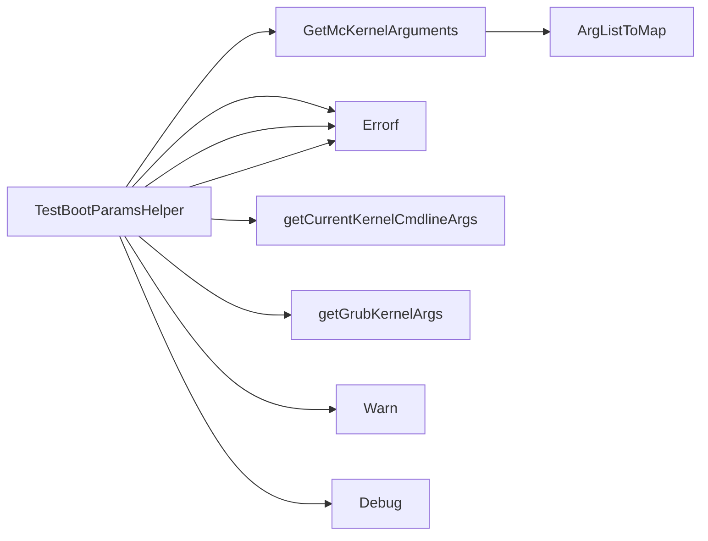

## Package bootparams (github.com/redhat-best-practices-for-k8s/certsuite/tests/platform/bootparams)

# BootParams Test Package – Overview

The **`bootparams`** package contains helper logic that validates the Linux kernel boot arguments used by a containerised test environment.  
It is used in the Certsuite platform tests to ensure that the expected kernel parameters are present when the system boots.

| Section | What it contains |
|---------|------------------|
| **Constants** | `grubKernelArgsCommand` – shell command that extracts GRUB’s kernel‑args from `/boot/grub2/grub.cfg`. <br> `kernelArgscommand` – command to read the running kernel’s boot line (`/proc/cmdline`). |
| **Functions** | 4 public/internal functions (see below). No global state or exported types. |

---

## Key Functions & Their Flow

### 1. `TestBootParamsHelper`

```go
func TestBootParamsHelper(env *provider.TestEnvironment, container *provider.Container, log *log.Logger) error
```

*Purpose*: Entry point for the boot‑parameter test.  
*Workflow*:

| Step | Action | Output |
|------|--------|--------|
| 1 | Calls `GetMcKernelArguments` to obtain the **expected** kernel arguments (from the platform’s “Mc” config). | `expArgs map[string]string` |
| 2 | Retrieves **actual** arguments from two sources:<br>• current running kernel (`getCurrentKernelCmdlineArgs`) <br>• GRUB configuration (`getGrubKernelArgs`) | `curArgs`, `grubArgs` maps |
| 3 | Compares expected vs. actual:<br>- If an argument is missing or has a different value, log **Error**.<br>- If the values match but are not exactly identical (e.g., ordering), log **Warn** and provide debug details. | None – errors returned to test harness |

> **Result**: The function returns `nil` if all checks pass; otherwise an error is reported.

### 2. `GetMcKernelArguments`

```go
func GetMcKernelArguments(env *provider.TestEnvironment, key string) map[string]string
```

*Purpose*: Convert the platform’s kernel‑argument list (comma‑separated string stored in `env.Platform.McConfig`) into a map for easy comparison.

*Implementation*:
1. Read the value of `key` from the config (`env.Platform.McConfig[key]`).  
2. Split by comma, then call `ArgListToMap` to turn `"arg=value"` pairs into a `map[string]string`.

> **Note**: If the key is missing or empty, an empty map is returned.

### 3. `getGrubKernelArgs`

```go
func getGrubKernelArgs(env *provider.TestEnvironment, containerName string) (map[string]string, error)
```

*Purpose*: Extract the kernel arguments that GRUB would pass to the booted kernel.

*Process*:
1. Execute `grubKernelArgsCommand` inside the given container using a client from `clientsholder`.  
2. The command returns lines such as `"linux16 /vmlinuz ... root=... ro"`.  
3. Split into individual words, filter only those that start with `kernel-args=` (using `FilterArray` + `HasPrefix`).  
4. Strip the prefix and split the remaining string by commas to get individual key/value pairs.  
5. Convert the list to a map via `ArgListToMap`.

*Error handling*: Any command failure or parsing issue returns an error that bubbles up to `TestBootParamsHelper`.

### 4. `getCurrentKernelCmdlineArgs`

```go
func getCurrentKernelCmdlineArgs(env *provider.TestEnvironment, containerName string) (map[string]string, error)
```

*Purpose*: Read the kernel command line of the currently running host (or test container).

*Process*:
1. Execute `kernelArgscommand` (`cat /proc/cmdline`) inside the target container.  
2. The output is a single space‑separated string; split it into individual arguments.  
3. Trim any trailing newline (`TrimSuffix`).  
4. Convert the list to a map with `ArgListToMap`.

*Error handling*: Similar to `getGrubKernelArgs`; failures propagate up.

---

## How Everything Connects

``mermaid
flowchart TD
    A[TestBootParamsHelper] --> B[GetMcKernelArguments]
    A --> C[getCurrentKernelCmdlineArgs]
    A --> D[getGrubKernelArgs]

    B -->|parse config| E[ArgListToMap]
    C -->|exec cat /proc/cmdline| F[ExecCommandContainer]
    C -->|split + map| E
    D -->|exec grub2-editenv| G[ExecCommandContainer]
    D -->|filter kernel-args= | H[FilterArray]
    D -->|split comma| I[ArgListToMap]

    subgraph "Comparison Logic"
        B -.-> J[Compare with curArgs & grubArgs]
    end
```

* The **environment** (`provider.TestEnvironment`) supplies the platform configuration and client holder.  
* Both helper functions `getCurrentKernelCmdlineArgs` and `getGrubKernelArgs` use the same pattern: execute a command in the container, parse its output, and return a map of key/value pairs.  
* `TestBootParamsHelper` orchestrates these calls, logs discrepancies (errors or warnings), and returns an error to the test harness if any mismatch occurs.

---

## Summary

- **No global state** – everything is passed via parameters.
- **Data flow**: Config string → map → comparison with runtime data maps.
- **Error handling**: All command‑execution failures are surfaced as errors; mismatches are logged as `Error` or `Warn`.
- **Extensibility**: Adding new kernel argument checks simply involves extending the config key list and reusing the existing parsing logic.

This structure keeps the boot‑parameter validation isolated, testable, and easy to maintain.

### Functions

- **GetMcKernelArguments** — func(*provider.TestEnvironment, string)(map[string]string)
- **TestBootParamsHelper** — func(*provider.TestEnvironment, *provider.Container, *log.Logger)(error)

### Call graph (exported symbols, partial)



### Symbol docs

- [function GetMcKernelArguments](symbols/function_GetMcKernelArguments.md)
- [function TestBootParamsHelper](symbols/function_TestBootParamsHelper.md)
