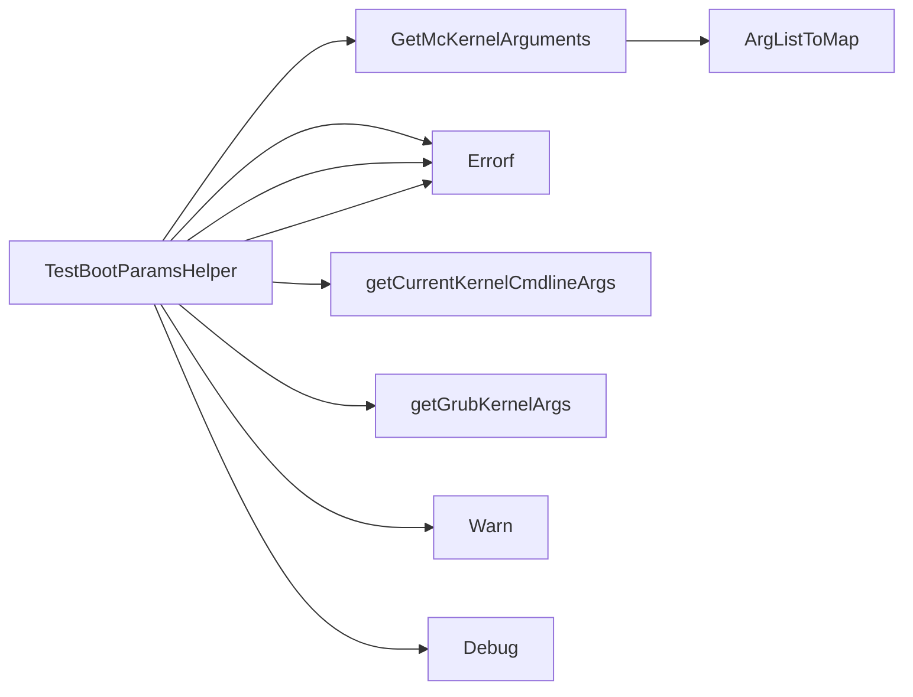

## Package bootparams (github.com/redhat-best-practices-for-k8s/certsuite/tests/platform/bootparams)

### Functions

- **GetMcKernelArguments** — func(*provider.TestEnvironment, string)(map[string]string)
- **TestBootParamsHelper** — func(*provider.TestEnvironment, *provider.Container, *log.Logger)(error)

### Call graph (exported symbols, partial)

### Symbol docs

- [function GetMcKernelArguments](symbols/function_GetMcKernelArguments.md)
- [function TestBootParamsHelper](symbols/function_TestBootParamsHelper.md)
