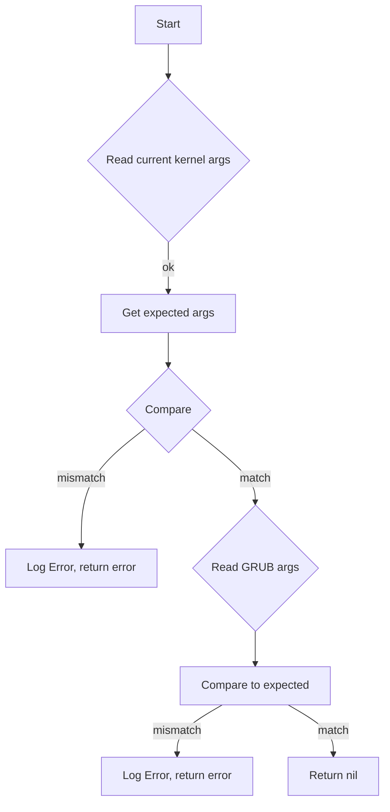

TestBootParamsHelper`

| Item | Details |
|------|---------|
| **Package** | `github.com/redhat-best-practices-for-k8s/certsuite/tests/platform/bootparams` |
| **Signature** | `func TestBootParamsHelper(env *provider.TestEnvironment, container *provider.Container, log *log.Logger) error` |
| **Exported?** | Yes |

### Purpose
`TestBootParamsHelper` is a helper used by the test suite to validate that the kernel boot‑parameter strings extracted from two different sources – the current running kernel and the GRUB configuration – are consistent with what CertSuite expects.  
The function is called during tests that run inside a containerised environment (`*provider.Container`) and relies on the broader `TestEnvironment` context for any test‑specific state.

### Inputs

| Parameter | Type | Role |
|-----------|------|------|
| `env` | `*provider.TestEnvironment` | Holds shared state or configuration used across tests. The helper does not modify it. |
| `container` | `*provider.Container` | Represents the container where the test is executed; only needed for logging context. |
| `log` | `*log.Logger` | Logger used to emit diagnostic messages (debug, warn, error). |

### Outputs

- Returns an `error`.  
  * `nil` indicates that both kernel‑parameter sources matched and no problems were found.*  
  * A non‑nil error is produced when the helper detects a mismatch or cannot retrieve the data.

### Key Dependencies & Flow

1. **Retrieve current kernel args** – `getCurrentKernelCmdlineArgs()`  
   - Reads `/proc/cmdline` (or similar) to obtain the arguments passed to the running kernel.

2. **Retrieve expected kernel args** – `GetMcKernelArguments(env)`  
   - Pulls the boot‑parameter string that CertSuite has recorded or computed for this test environment.

3. **Compare current vs. expected**  
   - If they differ, log an error (`log.Errorf`) and return a descriptive error indicating the mismatch.

4. **Retrieve GRUB args** – `getGrubKernelArgs()`  
   - Reads the GRUB configuration (typically `/boot/grub2/grub.cfg` or similar) to extract the boot arguments that will be used on next reboot.

5. **Compare GRUB vs. expected**  
   - Again, any discrepancy is logged as an error and results in a returned error.

6. **Logging** – Throughout the process:
   - `Warn` and `Debug` are used for non‑critical information (e.g., when kernel args are present but not strictly required).
   - `Errorf` records failures that cause the helper to return.

### Side Effects

- The function does **not modify** any of its inputs or global state.
- It performs read operations on the filesystem and logs messages; these I/O actions are considered side effects but are benign for test purposes.

### How it Fits in the Package

`bootparams` contains utilities for inspecting kernel boot parameters.  
`TestBootParamsHelper` is a **test helper** that centralises the logic needed by several test cases to verify consistency between:

1. The running kernel’s arguments.
2. The arguments expected by CertSuite (via `GetMcKernelArguments`).
3. The GRUB configuration’s arguments.

By isolating this comparison logic, individual tests can simply call `TestBootParamsHelper` and focus on higher‑level assertions.

---

#### Suggested Mermaid Diagram

This diagram visualises the decision path and highlights the key comparisons performed by `TestBootParamsHelper`.
