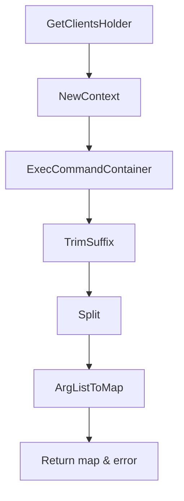

getCurrentKernelCmdlineArgs`

```go
func getCurrentKernelCmdlineArgs(env *provider.TestEnvironment, container string) (map[string]string, error)
```

## Purpose

`getCurrentKernelCmdlineArgs` extracts the kernel command‑line arguments that are currently active inside a given test container.  
It runs `grub2-editenv list` (or the equivalent `kernelargscommand`) to obtain the raw command line, parses it into key/value pairs and returns them as a map.

This helper is used by other tests in the *bootparams* package to verify that the kernel was started with the expected parameters.

## Inputs

| Parameter | Type                     | Description |
|-----------|--------------------------|-------------|
| `env`     | `*provider.TestEnvironment` | Holds test context, client connections and logging facilities. |
| `container` | `string`                 | Name of the container in which to query the kernel command line. |

## Outputs

- **`map[string]string`** – each key/value pair from the current kernel command line (e.g., `"console":"ttyS0"`).  
- **`error`** – non‑nil if any step fails: retrieving clients, executing the command, parsing the output, or converting arguments to a map.

## Key Dependencies & Flow

1. **Client Retrieval**  
   ```go
   cl := env.GetClientsHolder()
   ```
   Gets the holder that knows how to talk to the target node.

2. **Context Creation**  
   ```go
   ctx := NewContext(cl)
   ```
   Wraps the client in a `context.Context` used by the exec helper.

3. **Command Execution**  
   ```go
   out, err := ExecCommandContainer(ctx, container, grubKernelArgsCommand)
   ```
   Runs either `"grub2-editenv list"` or `"kernelargscommand"` inside the specified container and captures its stdout.

4. **Error Handling**  
   Any execution error is wrapped with `fmt.Errorf` for richer diagnostics.

5. **Output Normalisation**  
   ```go
   out = strings.TrimSuffix(out, "\n")
   ```
   Removes a trailing newline that `grub2-editenv` appends.

6. **Argument Splitting & Mapping**  
   ```go
   args := strings.Split(out, " ")
   return ArgListToMap(args)
   ```
   Splits the command line into individual arguments and converts them to a map using the helper `ArgListToMap`.

## Side Effects

- No state is mutated outside of local variables.  
- The function only performs read‑only operations on the container’s filesystem via exec.

## Package Context

`bootparams` tests validate that kernel boot parameters are correctly propagated into a running pod.  
This helper isolates the plumbing required to query those parameters, allowing higher‑level test functions to focus on assertions rather than command execution mechanics.

---

### Suggested Mermaid Diagram (for internal reference)



The diagram illustrates the linear flow from obtaining the client to producing the final argument map.
