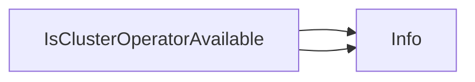

## Package clusteroperator (github.com/redhat-best-practices-for-k8s/certsuite/tests/platform/clusteroperator)

## ClusterOperator Test Package – Overview

| Topic | Details |
|-------|---------|
| **Purpose** | Provides a helper that checks whether an OpenShift `ClusterOperator` is in the *Available* state, emitting diagnostic logs for each step. |
| **Imports** | ```go<br>import ("github.com/openshift/api/config/v1")<br>import ("github.com/redhat-best-practices-for-k8s/certsuite/internal/log")<br>``` |
| **Key Data Structures** | *`configv1.ClusterOperator`* – the OpenShift API type that represents a cluster operator. It contains a `Status` field with an array of `ClusterOperatorCondition`. Each condition has `Type`, `Status`, and other metadata. The function inspects the condition whose `Type` is `"Available"` to decide if the operator reports availability. |
| **Key Function** | ```go<br>func IsClusterOperatorAvailable(op *configv1.ClusterOperator) bool<br>```<br>  *Input:* a pointer to a `ClusterOperator`.<br>  *Output:* `true` if an `"Available"` condition with `Status: True` exists; otherwise `false`.<br>  *Behavior Flow* |
| **Flow Diagram** | ```mermaid\nsequenceDiagram\n    participant Client as Test Code\n    participant IsClusterOperatorAvailable as Function\n    Client->>IsClusterOperatorAvailable: pass ClusterOperator ptr\n    IsClusterOperatorAvailable->>log: Info(\"Checking availability of %s\", op.Name)\n    loop over op.Status.Conditions\n        alt condition.Type == \"Available\"\n            IsClusterOperatorAvailable->>log: Info(\"Found Available condition for %s\", op.Name)\n            IsClusterOperatorAvailable-->>Client: true\n        else\n            IsClusterOperatorAvailable->>log: Info(\"No Available condition found for %s\", op.Name)\n    end\n    IsClusterOperatorAvailable-->>Client: false\n``` |
| **Implementation Notes** | * The function logs two messages: one at the start and one when it finds (or fails to find) an `"Available"` condition.<br>* It performs a linear scan over `op.Status.Conditions`; this is efficient for the typically small number of conditions per operator.<br>* No global state or constants are involved; all data comes from the passed `ClusterOperator` instance. |
| **Usage Context** | In test suites, callers pass the result of a Kubernetes client call (e.g., `client.ClusterOperators().Get(...)`) to determine if an operator has reached the desired ready state before proceeding with further validation steps. |

### Summary

The package supplies a single utility function that interrogates an OpenShift `ClusterOperator`’s status for availability, providing clear logging at each step. It is intentionally lightweight, free of side‑effects or global configuration, making it suitable for repeated use in automated test flows.

### Functions

- **IsClusterOperatorAvailable** — func(*configv1.ClusterOperator)(bool)

### Call graph (exported symbols, partial)



### Symbol docs

- [function IsClusterOperatorAvailable](symbols/function_IsClusterOperatorAvailable.md)
