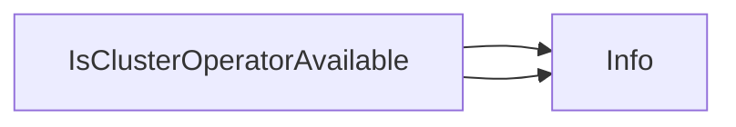

## Package clusteroperator (github.com/redhat-best-practices-for-k8s/certsuite/tests/platform/clusteroperator)

### Functions

- **IsClusterOperatorAvailable** — func(*configv1.ClusterOperator)(bool)

### Call graph (exported symbols, partial)

### Symbol docs

- [function IsClusterOperatorAvailable](symbols/function_IsClusterOperatorAvailable.md)
