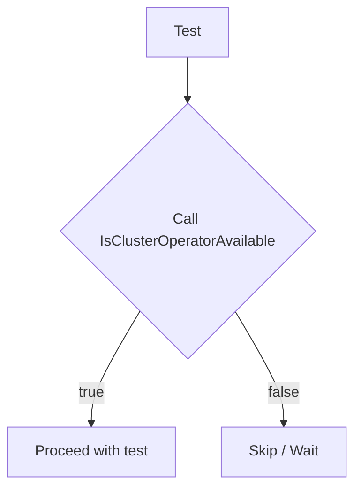

IsClusterOperatorAvailable` – Package `clusteroperator`

**File:** `tests/platform/clusteroperator/clusteroperator.go`  
**Line:** 8

## Purpose
Determines whether a Kubernetes *Cluster Operator* is in the **available** state.

The function inspects the `Status.Available` field of a `configv1.ClusterOperator`.  
If the operator reports that it is available, the test framework can proceed with
operations that rely on that operator; otherwise it signals that the operator
is not yet ready.

## Signature

```go
func IsClusterOperatorAvailable(op *configv1.ClusterOperator) bool
```

| Parameter | Type | Description |
|-----------|------|-------------|
| `op` | `*configv1.ClusterOperator` | The cluster‑operator object to evaluate. |

| Return | Type | Meaning |
|--------|------|---------|
| `bool` | true if the operator’s status indicates *Available*, otherwise false. |

## Key Dependencies

- **`configv1.ClusterOperator`** – OpenShift API type that contains a `Status.Available` field.
- **Logging (`Info`)** – The function logs two messages:
  - The start of the availability check.
  - The result (available or not) along with the operator’s name.

No external packages are imported beyond those required for logging and the OpenShift API types.

## Side‑Effects

The only observable side‑effect is the generation of log entries via the `Info` function.  
It does **not** modify the passed `ClusterOperator` object nor any global state.

## Integration into the Package

The `clusteroperator` package supplies utilities for tests that need to verify
the readiness of OpenShift cluster operators before exercising further logic.
`IsClusterOperatorAvailable` is a core helper used by higher‑level test helpers or
directly in individual test cases to gate execution based on operator status.



This function is intentionally lightweight: it performs a single read of the
operator status and returns a boolean, keeping tests fast and deterministic.
