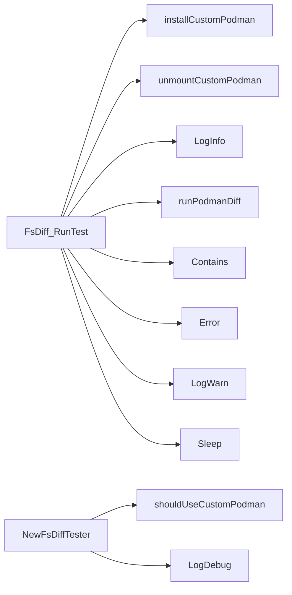

## Package cnffsdiff (github.com/redhat-best-practices-for-k8s/certsuite/tests/platform/cnffsdiff)

# cnffsdiff – Filesystem‑Diff Test

`cnffsdiff` is a single‑file test that verifies whether the probe pod’s
filesystem layout matches what the target OpenShift node exposes.
The test runs `podman diff --format json` inside the probe pod,
parses the output, and compares it against a set of *target folders*
that are expected to exist on every node.

> **Goal** – detect accidental removal or modification of required
> directories (e.g. `/etc/kubernetes`, `/var/lib/openshift`) by the
> container runtime inside the probe pod.

---

## Core Data Structures

| Type | Purpose | Key fields |
|------|---------|------------|
| `FsDiff` | **Test harness** – holds all state needed to run the test. | `ChangedFolders []string`, `DeletedFolders []string`, `Error error`, `check *checksdb.Check`, <br>`clientHolder clientsholder.Command`, `ctxt clientsholder.Context`, `result int`, `useCustomPodman bool` |
| `fsDiffJSON` (unexported) | Helper for unmarshalling the JSON returned by `podman diff`. | `Added []string`, `Changed []string`, `Deleted []string` |

The `FsDiffFuncs` interface simply exposes the two public methods of
`FsDiff`: `RunTest(string)` and `GetResults()`.

---

## Global constants & variables

```go
const (
    partnerPodmanFolder     = "/var/lib/containers"
    tmpMountDestFolder      = "/tmp/mnt"
    errorCode125RetrySeconds = 5 // seconds to wait before retrying on exit code 125
)

var (
    nodeTmpMountFolder = fmt.Sprintf("%s/%s", tmpMountDestFolder, "node")
    targetFolders      = []string{"/etc/kubernetes", "/var/lib/openshift"} // trimmed for brevity
)
```

* `partnerPodmanFolder` – path where the pre‑compiled podman binary is
  stored in the probe pod.
* `tmpMountDestFolder` – a temporary mount point used when probing
  custom podman on older RHEL/OCP nodes.
* `nodeTmpMountFolder` – expands to `<tmpMountDestFolder>/node`
  and is where the node’s root filesystem is temporarily mounted for
  diffing.

---

## Construction

```go
func NewFsDiffTester(
    check *checksdb.Check,
    clientHolder clientsholder.Command,
    ctxt clientsholder.Context,
    podName string) *FsDiff {
    useCustom := shouldUseCustomPodman(check, podName)
    return &FsDiff{check: check, clientHolder: clientHolder, ctxt: ctxt, useCustomPodman: useCustom}
}
```

* The helper `shouldUseCustomPodman` decides whether to run the
  pre‑compiled (RHEL 8‑only) podman binary or the system default.
  It uses **semver** to compare the node’s OCP version against
  `4.13.0`.  
  *If the node is older, custom podman must be used.*

---

## Workflow of `RunTest`

```go
func (f *FsDiff) RunTest(podName string) {
    // 1. Install / remove the custom podman binary if required.
    if f.useCustomPodman { installCustomPodman(); defer unmountCustomPodman() }

    // 2. Execute `podman diff` inside the probe pod.
    out, err := f.runPodmanDiff(podName)

    // 3. Parse JSON output into fsDiffJSON.
    var diff fsDiffJSON
    if err := json.Unmarshal([]byte(out), &diff); err != nil { … }

    // 4. Filter to only the folders that are in targetFolders.
    f.DeletedFolders = intersectTargetFolders(diff.Deleted)
    f.ChangedFolders = intersectTargetFolders(diff.Changed)

    // 5. Record result status.
    if len(f.DeletedFolders)+len(f.ChangedFolders) == 0 {
        f.result = 0
    } else { f.result = 1; f.Error = errors.New("unexpected changes") }
}
```

* **`installCustomPodman`**  
  * Creates a temporary directory (`nodeTmpMountFolder`) inside the pod.  
  * Mounts the node’s root filesystem into it (via `mount -t none`).  
  * Copies the custom podman binary from `$partnerPodmanFolder` to
    the mount point.

* **`unmountCustomPodman`**  
  * Unmounts the temporary mount and removes the folder.

* **`runPodmanDiff`**  
  * Builds a `podman diff --format json <nodeTmpMountFolder>` command.
  * Executes it via `clientsholder.ExecCommandContainer`.
  * Retries on exit code 125 (typical for “no changes”) after
    `errorCode125RetrySeconds`.

* **`intersectTargetFolders`**  
  * Filters a list of folder paths so that only those present in
    the global `targetFolders` slice are kept.
  * Logs a warning if a folder from `diff` is not part of the expected set.

---

## Result extraction

```go
func (f *FsDiff) GetResults() int { return f.result }
```

The test harness returns `0` when no unexpected changes were found,
otherwise `1`.  
Any detailed error information can be retrieved via `f.Error`.

---

## How everything is wired together

```mermaid
graph TD;
    CheckDB[checksdb.Check] -->|passed to| FsDiff[FsDiff];
    ClientHolder[clientsholder.Command] -->|executes commands| FsDiff;
    Context[clientsholder.Context] -->|provides pod context| FsDiff;

    subgraph ProbePod
        FsDiff --runPodmanDiff--> ExecCmd[ExecCommandContainer]
        ExecCmd --> Podman[podman binary inside pod]
        Podman --> DiffOutput[JSON diff]
    end

    FsDiff --parse JSON--> fsDiffJSON;
    fsDiffJSON --filter--> FsDiff.DeletedFolders, ChangedFolders;

    FsDiff --final status--> Result[int];
```

1. **Setup** – `NewFsDiffTester` creates an `FsDiff` instance,
   deciding whether a custom podman binary is needed.
2. **Execution** – `RunTest` mounts the node filesystem if required,
   runs `podman diff`, parses and filters the output, then records
   success/failure.
3. **Result retrieval** – callers use `GetResults()` to obtain the test
   outcome.

---

## Key Points

* The test is intentionally lightweight: it only cares about a few
  critical directories (`targetFolders`).
* It works around older RHEL/OCP nodes that cannot run the system
  podman binary by temporarily mounting the node’s root and copying a
  compatible podman binary into place.
* Exit code 125 from `podman diff` is treated as “no changes” and the
  command is retried after a short pause.
* All interactions with the probe pod are mediated through the
  `clientsholder.Command` interface, keeping the test independent of
  any specific client implementation.

### Structs

- **FsDiff** (exported) — 8 fields, 11 methods
- **fsDiffJSON**  — 3 fields, 0 methods

### Interfaces

- **FsDiffFuncs** (exported) — 2 methods

### Functions

- **FsDiff.GetResults** — func()(int)
- **FsDiff.RunTest** — func(string)()
- **NewFsDiffTester** — func(*checksdb.Check, clientsholder.Command, clientsholder.Context, string)(*FsDiff)

### Globals


### Call graph (exported symbols, partial)



### Symbol docs

- [struct FsDiff](symbols/struct_FsDiff.md)
- [interface FsDiffFuncs](symbols/interface_FsDiffFuncs.md)
- [function FsDiff.GetResults](symbols/function_FsDiff_GetResults.md)
- [function FsDiff.RunTest](symbols/function_FsDiff_RunTest.md)
- [function NewFsDiffTester](symbols/function_NewFsDiffTester.md)
