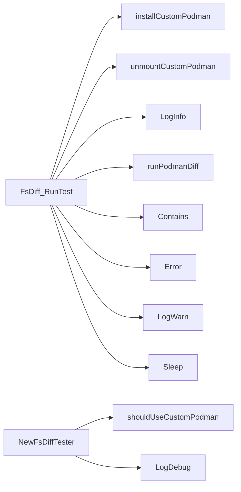

## Package cnffsdiff (github.com/redhat-best-practices-for-k8s/certsuite/tests/platform/cnffsdiff)

### Structs

- **FsDiff** (exported) — 8 fields, 11 methods
- **fsDiffJSON**  — 3 fields, 0 methods

### Interfaces

- **FsDiffFuncs** (exported) — 2 methods

### Functions

- **FsDiff.GetResults** — func()(int)
- **FsDiff.RunTest** — func(string)()
- **NewFsDiffTester** — func(*checksdb.Check, clientsholder.Command, clientsholder.Context, string)(*FsDiff)

### Globals

### Call graph (exported symbols, partial)

### Symbol docs

- [struct FsDiff](symbols/struct_FsDiff.md)
- [interface FsDiffFuncs](symbols/interface_FsDiffFuncs.md)
- [function FsDiff.GetResults](symbols/function_FsDiff_GetResults.md)
- [function FsDiff.RunTest](symbols/function_FsDiff_RunTest.md)
- [function NewFsDiffTester](symbols/function_NewFsDiffTester.md)
