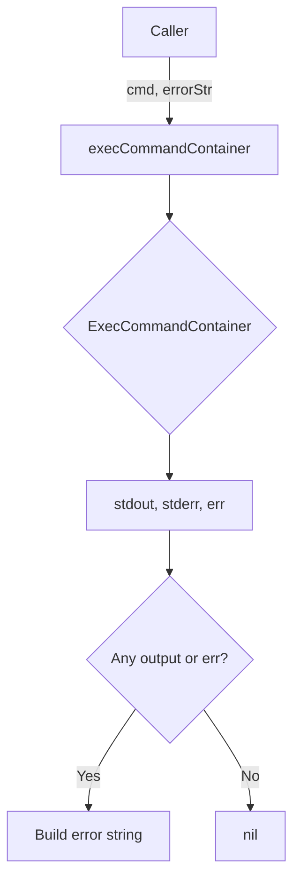

FsDiff.execCommandContainer`

| Item | Details |
|------|---------|
| **Package** | `cnffsdiff` – test utilities for comparing container filesystems |
| **Receiver** | `f *FsDiff` – the diff context that holds probe pod information |
| **Signature** | `func (f FsDiff) execCommandContainer(cmd string, errorStr string) error` |

### Purpose
`execCommandContainer` is a small helper used by the test harness to run an arbitrary shell command inside the *probe* pod that was started for a container under test.  
The probe pod is created elsewhere in `FsDiff` and its name is stored on the receiver.

If the command produces any output (stdout or stderr) **or** if the underlying execution fails, the function treats it as a test failure. It returns an error that concatenates:

1. The caller‑supplied prefix (`errorStr`)  
2. The captured stdout content  
3. The captured stderr content  
4. Any error returned by `ExecCommandContainer`

This design forces tests to fail when unexpected output appears, making the helper suitable for sanity checks such as “`ls /etc/passwd` should produce no output”.

### Inputs
| Parameter | Type | Description |
|-----------|------|-------------|
| `cmd` | `string` | The shell command to run inside the probe pod. |
| `errorStr` | `string` | Prefix that describes why a non‑empty result is an error (e.g., `"unexpected output from ls"`). |

### Outputs
| Return | Type | Meaning |
|--------|------|---------|
| `error` | `error` | `nil` if the command executed with *no* stdout, *no* stderr and no execution error. Otherwise a descriptive error string built as described above. |

### Key Dependencies
| Dependency | Role |
|------------|-----|
| `ExecCommandContainer(cmd string) (stdout string, stderr string, err error)` | Executes the supplied command inside the probe pod and returns its output streams plus any execution error. It is defined in the same package but not shown here. |
| `New(f *FsDiff)` | Constructs a new instance of `FsDiff` from an existing one; used to get fresh context for executing the command. |
| `fmt.Sprintf` | Formats the final error string when concatenating components. |

### Side‑Effects
* No state on `f` is modified – the function is pure with respect to the receiver.
* The only observable effect is the returned error, which signals test failure.

### Usage Context
The helper is invoked by various test cases that need to validate filesystem contents inside a container.  
Typical usage pattern:

```go
err := f.execCommandContainer("ls /etc/passwd", "unexpected file listing")
require.NoError(t, err)
```

If `/etc/passwd` exists or the command fails, the test will fail with an informative message.

### Diagram (optional)



This function is a small but crucial part of the `cnffsdiff` package, ensuring that any unexpected side‑effects inside probe pods are caught early during test runs.
