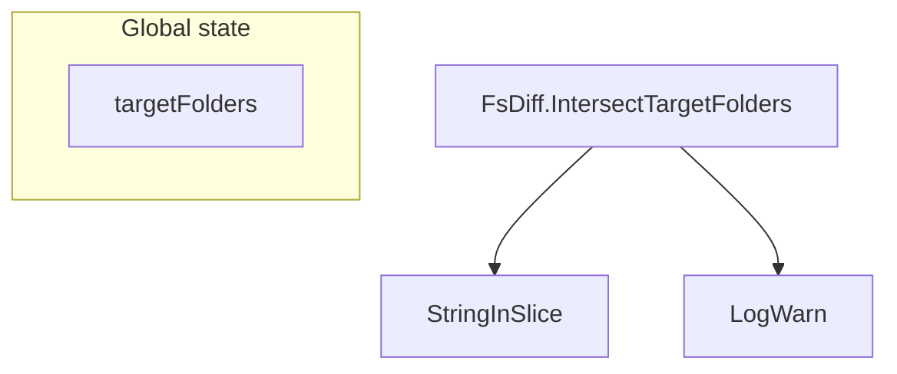

FsDiff.intersectTargetFolders`

| | |
|---|---|
| **Package** | `cnffsdiff` – helper utilities used by the CertSuite integration tests to compare filesystem snapshots of container images. |
| **Receiver** | `fsd *FsDiff` – a struct that holds the state required for a diff operation (e.g., source and target mounts). |

### Purpose
`intersectTargetFolders` computes the intersection between two lists of directory paths:

1. The list supplied by the caller (`[]string`) – typically the set of folders that were **mounted** into a temporary location during a test run.
2. The global `targetFolders` slice – a pre‑defined set of directories that are considered relevant for comparison (e.g., `/etc`, `/var/log`, etc.).

The result is the subset of *both* lists, i.e. only those folders that exist in both the runtime environment and the expected target list. This is used to narrow down which directories should be compared when performing a filesystem diff.

### Signature
```go
func (fsd *FsDiff) intersectTargetFolders(paths []string) []string
```

- **Input** – `paths`: slice of strings representing folder paths that were discovered or mounted.
- **Output** – a new slice containing only those entries that are present in both `paths` and the global `targetFolders`.

### Key Dependencies

| Dependency | Role |
|------------|------|
| `StringInSlice` | Utility function that checks if a string is contained within a slice. It drives the intersection logic. |
| `LogWarn` | Emits a warning log when no common folders are found, aiding debugging of test failures. |
| `append` | Standard Go builtin used to build the resulting slice. |

### Side Effects

- **No mutation** – The function does not modify its input slices or any global state.
- **Logging** – If the intersection is empty, a warning message is printed via `LogWarn`. This side effect is the only observable change outside of the return value.

### Interaction with the Rest of the Package



1. `intersectTargetFolders` is called by higher‑level diff logic (e.g., when preparing the list of directories to compare).
2. It relies on the globally defined `targetFolders`, which is initialized elsewhere in the package.
3. The result feeds into subsequent steps that mount these folders, run comparisons, and aggregate diffs.

### Summary
`FsDiff.intersectTargetFolders` filters a caller‑supplied list of folder paths to only those that are also present in the globally configured `targetFolders`. It is a pure helper with minimal side effects (warning logs) and serves as a preparatory step for filesystem diff operations within the CertSuite test harness.
