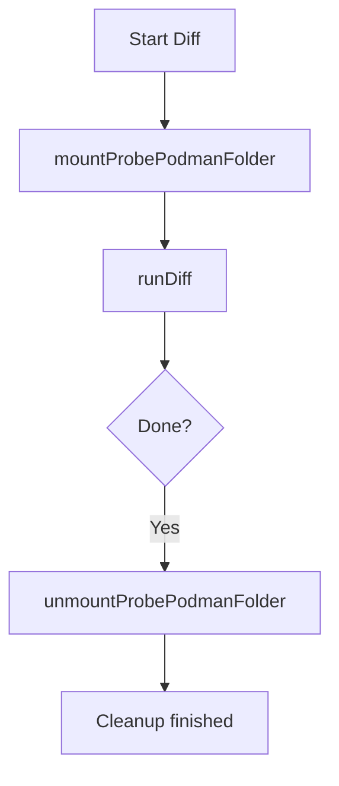

FsDiff.unmountProbePodmanFolder`

| Item | Detail |
|------|--------|
| **Package** | `cnffsdiff` (github.com/redhat-best-practices-for-k8s/certsuite/tests/platform/cnffsdiff) |
| **Receiver type** | `*FsDiff` |
| **Signature** | `func (f *FsDiff) unmountProbePodmanFolder() error` |
| **Exported?** | No – internal helper used only by the test harness |

### Purpose
During a CNF (Container Network Function) filesystem diff run, the probe pod mounts its own container image into a temporary location (`tmpMountDestFolder`).  
When the diff completes, this function unmounts that folder from the host so that subsequent tests start with a clean state.

It is invoked after all file‑system comparisons have finished, usually in `FsDiff.finish()` or directly by test code. The function does **not** return any data except an error indicating success or failure of the unmount operation.

### Inputs & Outputs
| Parameter | Description |
|-----------|-------------|
| `f *FsDiff` | The receiver holds state such as `probePodmanImageID`, `tmpMountDestFolder`, etc. No direct input parameters are passed to the function itself. |

| Return value | Type | Meaning |
|--------------|------|---------|
| `error` | `error` | Non‑nil if the unmount command fails or the cleanup routine reports an issue; nil on success. |

### Key Dependencies
1. **`execCommandContainer`** – helper that runs a shell command inside the test container (the *probe* pod).  
   ```go
   execCommandContainer(cmd string, args ...string) error
   ```
2. **`fmt.Sprintf`** – used twice to build the unmount command string:
   - `Sprintf("umount %s", f.tmpMountDestFolder)`
   - `Sprintf("rmdir %s", f.tmpMountDestFolder)` (if needed)

No external packages or global variables are referenced directly; it operates solely on fields of the receiver.

### Side Effects
* Executes a system command inside the probe container, which:
  * Calls `umount` on the temporary mount point.
  * May remove the directory if empty (via `rmdir`) – this is not guaranteed but attempted for cleanup.
* Modifies **no state** in the Go program other than possibly returning an error; all filesystem changes happen inside the container.

### How It Fits the Package
The `cnffsdiff` package orchestrates mounting, diffing, and unmounting of CNF file systems.  
- `unmountProbePodmanFolder()` is part of the teardown logic for a single diff run.
- It complements other functions like `mountProbePodmanFolder()` (which sets up the mount) and `runDiff()` (which performs the actual comparison).
- The package uses this helper to ensure that each test starts with a fresh, unmounted probe environment, preventing cross‑test contamination.

### Suggested Mermaid Flow



This diagram shows the unmount step as the final cleanup after diffing.
