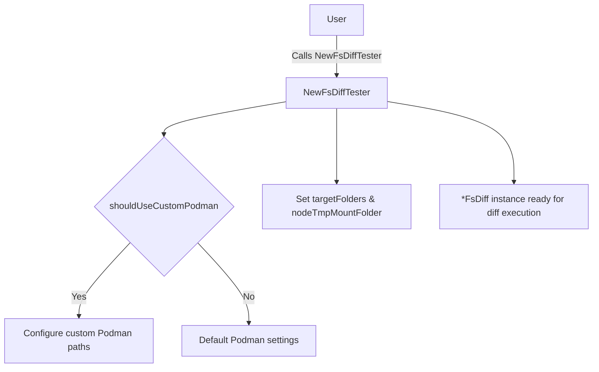

NewFsDiffTester`

### Purpose
Creates a ready‑to‑use **`FsDiff`** instance that drives the file‑system diff logic for CNF (Container Network Function) tests.  
It wires together:

1. **Check data** – the test case definition (`*checksdb.Check`).  
2. **Command runner** – an object capable of executing shell commands in the target environment (`clientsholder.Command`).  
3. **Context holder** – provides configuration such as host/namespace and logging utilities (`clientsholder.Context`).  
4. **Mount directory** – a temporary path on the test node where files will be extracted for comparison.

The returned `*FsDiff` is then used by other parts of the package to perform the actual diff against a reference snapshot.

### Signature
```go
func NewFsDiffTester(
    check *checksdb.Check,
    cmd clientsholder.Command,
    ctx clientsholder.Context,
    tmpMount string,
) *FsDiff
```

| Parameter | Type | Description |
|-----------|------|-------------|
| `check`   | `*checksdb.Check` | Test definition containing the target folder, expected snapshot, etc. |
| `cmd`     | `clientsholder.Command` | Interface that executes commands on the test node (e.g., via SSH). |
| `ctx`     | `clientsholder.Context` | Holds runtime configuration such as logging level and host details. |
| `tmpMount`| `string` | Path to a writable directory on the node where the diff will mount files. |

### Key Dependencies & Calls
- **`shouldUseCustomPodman()`** – Determines if the test should run against a custom Podman installation; influences how the filesystem is accessed.
- **`LogDebug()`** – Emits debug logs during construction to aid troubleshooting.

Both helpers are defined elsewhere in the package (likely in `fsdiff.go` or related files). No external services are invoked beyond the provided command interface.

### Side Effects
The function itself does **not** perform any I/O. It only initializes fields of an `FsDiff` struct:

- Sets internal paths (`targetFolders`, `nodeTmpMountFolder`) based on the provided parameters and constants.
- Configures logging levels through `ctx`.
- Decides on Podman usage via `shouldUseCustomPodman()`.

Thus, calling this function is safe in a test harness; it merely prepares state for later operations that will actually mount files and run diffs.

### Relationship to the Package
`cnffsdiff` is responsible for verifying that the filesystem layout of a CNF matches an expected snapshot. `NewFsDiffTester` is the factory that creates the **test runner** (`*FsDiff`) which orchestrates:

1. Mounting the CNF image or container.
2. Extracting relevant directories.
3. Comparing them against the reference.

Without this constructor, callers would need to manually populate an `FsDiff`, leading to duplicated setup logic across tests.

### Suggested Mermaid Diagram



This diagram shows the decision point around custom Podman usage and how the constructor sets up the necessary state.
