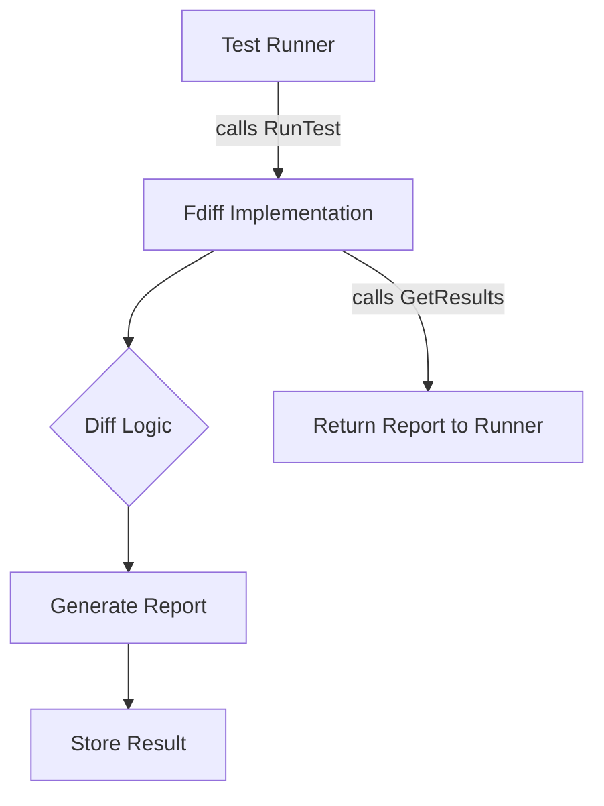

FsDiffFuncs` – Test‑Run & Result Retrieval Interface

| Item | Details |
|------|---------|
| **Location** | `cnffsdiff/fsdiff.go:83` (package `github.com/redhat-best-practices-for-k8s/certsuite/tests/platform/cnffsdiff`) |
| **Exported** | Yes – intended for use by other test packages or the main test runner. |

### Purpose

The `FsDiffFuncs` interface abstracts the core functionality required to:

1. **Execute a filesystem‑diff test** (`RunTest`).  
2. **Collect and expose the outcomes** of that execution (`GetResults`).

It is designed so that concrete implementations can vary (e.g., local vs. remote differs, mock testers) while remaining interchangeable in the rest of the test harness.

### Methods

| Method | Signature | Inputs | Outputs | Key side‑effects |
|--------|-----------|--------|---------|------------------|
| `RunTest` | `func() error` | None | `error` – nil on success, non‑nil if any part of the diff process fails. | Performs the actual comparison between two filesystems or manifests; may write temporary files, invoke external binaries, or log diagnostic information. |
| `GetResults` | `func() (string, error)` | None | `string` – a textual summary or detailed report of differences; `error` if results are unavailable or corrupted. | Returns the accumulated diff output; does **not** modify internal state but may read from temporary storage or in‑memory buffers. |

### Dependencies

- Relies on the underlying test infrastructure (e.g., file I/O, external diff tools).  
- May interact with environment variables or configuration files that dictate which diff algorithm to use.  
- Typically used by higher‑level structs such as `DiffRunner` or test suites that orchestrate multiple runs.

### Side Effects & Constraints

- **Side effects** are limited to the execution of the diff operation and result generation; no global state is mutated beyond what the concrete implementation requires.
- The interface guarantees that calling `GetResults` after a successful `RunTest` will provide meaningful data. If `RunTest` fails, `GetResults` may return an empty string or propagate an error.

### Fit within the Package

The `cnffsdiff` package focuses on comparing configuration files and filesystem snapshots for Kubernetes‑related tests.  
- **`FsDiffFuncs`** serves as the contract that all diff engines must satisfy, enabling the test harness to remain agnostic of specific implementation details.
- It facilitates unit testing by allowing mock implementations that simulate diff outcomes without performing real comparisons.

---

#### Suggested Mermaid Diagram

This diagram illustrates the interaction between a test runner and an implementation of `FsDiffFuncs`, emphasizing the separation of concerns.
