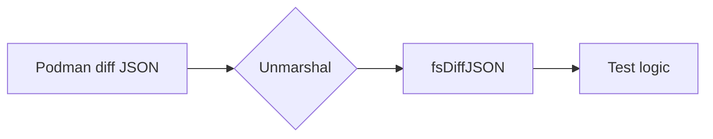

fsDiffJSON` – Internal helper for Podman diff output

| Item | Details |
|------|---------|
| **Package** | `cnffsdiff` (github.com/redhat-best-practices-for-k8s/certsuite/tests/platform/cnffsdiff) |
| **Visibility** | Unexported (`fsDiffJSON`) – used only inside the package. |

### Purpose
`fsDiffJSON` represents the JSON structure returned by `podman diff --format json`.  
The command emits a list of file‑system events for each container, grouped by event type:

```json
{
  "changed": ["folder1", "folder2"],
  "added"  : ["folder5", "folder6"],
  "deleted": ["folder3", "folder4"]
}
```

Only the **`changed`** and **`deleted`** lists are relevant for the test suite; a file that is both added and changed will appear twice, once in each list. The struct simply maps these three keys to Go slices.

### Fields
| Field | Type | Notes |
|-------|------|-------|
| `Added`   | `[]string` | Paths that were created during the container run. |
| `Changed` | `[]string` | Paths that existed before and were modified. |
| `Deleted` | `[]string` | Paths that disappeared after the container ran. |

### Usage Flow
1. **Command execution** – The test harness runs `podman diff --format json <container>`.
2. **JSON unmarshalling** – The output string is decoded into an `fsDiffJSON` instance.
3. **Filtering** – The package logic examines only `.Changed` and `.Deleted` entries to determine if the container’s filesystem matches expectations.

### Dependencies
* Standard library: `encoding/json` for unmarshalling, `fmt`, `os/exec` for running Podman.
* No external packages.

### Side‑effects
None.  
The struct is a pure data holder; no I/O or state changes occur during its use.

### Integration in the package


`fsDiffJSON` is the bridge between the raw Podman output and the test logic that validates container file‑system state. It keeps the unmarshalling code tidy and isolates the field names, making future format changes easier to handle.
