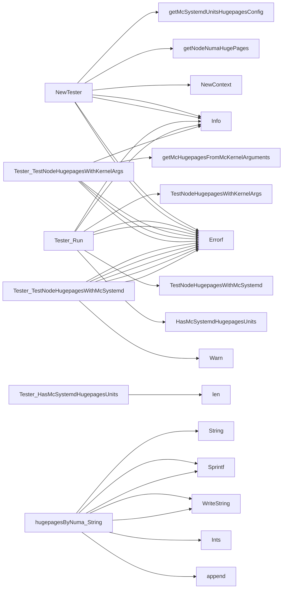

## Package hugepages (github.com/redhat-best-practices-for-k8s/certsuite/tests/platform/hugepages)

# HugePages Test Package – `github.com/redhat-best-practices-for-k8s/certsuite/tests/platform/hugepages`

The *hugepages* package implements a set of tests that validate the HugePages configuration on an OpenShift/Kubernetes node against the expectations defined in its MachineConfig.  
It is **read‑only** – no state is mutated outside of the `Tester` struct.

---

## 1. Core data structure

| Type | Exported? | Purpose |
|------|-----------|---------|
| `hugepagesByNuma` (`type hugepagesByNuma map[int]map[int]int`) | **No** (alias used internally) | Holds a two‑level mapping:  
&nbsp;&nbsp;*Key*: NUMA node index.  
&nbsp;&nbsp;*Value*: another map keyed by page size (in KiB), with the count of pages as value. |
| `Tester` | **Yes** | The main test harness that keeps all data needed to run the checks. |

### `Tester` fields

| Field | Type | Role |
|-------|------|------|
| `commander` | `clientsholder.Command` | Executes shell commands inside the test pod. |
| `context`   | `clientsholder.Context` | Holds context for command execution (timeout, cancellation). |
| `node`      | `*provider.Node` | The node under test – used only for its name/namespace. |
| `mcSystemdHugepagesByNuma` | `hugepagesByNuma` | HugePages info extracted from the MachineConfig’s systemd unit files. |
| `nodeHugepagesByNuma` | `hugepagesByNuma` | Actual hugepages reported by the node (`/sys/...`). |

---

## 2. Global constants

```go
RhelDefaultHugepages = []int{2048, 1048576}
RhelDefaultHugepagesz = []string{"2M", "1G"}
HugepagesParam   = "--hugepages="
HugepageszParam  = "--hugepagesz="
DefaultHugepagesz = 1024
KernArgsKeyValueSplitLen = 2
cmd, numRegexFields, outputRegex // compiled regexes used by getNodeNumaHugePages
```

* `RhelDefaultHugepages` / `RhelDefaultHugepagesz` provide the default page sizes that are expected on RHEL‑based clusters.
* The regex variables (`cmd`, etc.) are pre‑compiled for parsing `/sys/devices/system/node/.../hugepages/*_size_*` files.

---

## 3. Key helper functions

| Function | Signature | Responsibility |
|----------|-----------|----------------|
| `hugepageSizeToInt(string) int` | converts `"2M"` → `2048`, `"1G"` → `1048576`. Handles missing suffix by assuming KiB. |
| `getMcHugepagesFromMcKernelArguments(*provider.MachineConfig) (map[int]int, int)` | Parses the MachineConfig’s `kernelArguments` array to extract hugepage counts per size and the total pages. Logs warnings if parsing fails. |
| `getMcSystemdUnitsHugepagesConfig(*provider.MachineConfig) (hugepagesByNuma, error)` | Reads the systemd unit files listed in the MachineConfig (`systemd_units`) for HugePages configuration. Returns a map indexed by NUMA node and page size. |
| `logMcKernelArgumentsHugepages(map[int]int, int)` | Pretty‑prints the parsed kernel argument values (used only in debug logs). |
| `getNodeNumaHugePages() (hugepagesByNuma, error)` | Executes `cat /sys/devices/system/node/...` via the test pod’s container and builds a map of real node hugepage counts. Uses regexes to parse output. |

---

## 4. The `Tester` API

### Constructor

```go
NewTester(node *provider.Node, pod *corev1.Pod, cmd clientsholder.Command) (*Tester, error)
```

* Builds a new context (`clientsholder.NewContext`) for the test pod.
* Populates `nodeHugepagesByNuma` by calling `getNodeNumaHugePages`.
* Extracts systemd‑based hugepage config via `getMcSystemdUnitsHugepagesConfig`.
* Returns an error if either extraction fails.

### Run

```go
func (t *Tester) Run() error
```

Executes the two sub‑tests in order:

1. **MC systemd units** – calls `TestNodeHugepagesWithMcSystemd`.  
   If this check fails, logs the mismatch and returns an error.
2. **Kernel arguments** – calls `TestNodeHugepagesWithKernelArgs`.  
   A failure here also results in a logged error.

The method uses the helper `HasMcSystemdHugepagesUnits()` to decide whether to run the first test at all.

### Helper methods

| Method | Returns | Uses |
|--------|---------|------|
| `HasMcSystemdHugepagesUnits() bool` | true if any systemd unit was parsed. | Checks length of `mcSystemdHugepagesByNuma`. |
| `TestNodeHugepagesWithKernelArgs() (bool, error)` | `true` when node pages match kernel arguments; otherwise false and an error describing the mismatch. | Calls `getMcHugepagesFromMcKernelArguments`, compares totals. |
| `TestNodeHugepagesWithMcSystemd() (bool, error)` | `true` when node pages match systemd units; otherwise false and a detailed error. | Compares `nodeHugepagesByNuma` against `mcSystemdHugepagesByNuma`. |
| `getNodeNumaHugePages()` | Internal helper already described above. | Uses container exec to read `/sys/...`. |

---

## 5. Flow diagram (textual)

```
Tester.New
   ├─ build context from pod
   ├─ getNodeNumaHugePages → nodeHugepagesByNuma
   └─ getMcSystemdUnitsHugepagesConfig → mcSystemdHugepagesByNuma

Tester.Run
   │
   ├─ if HasMcSystemdHugepagesUnits()
   │    └─ TestNodeHugepagesWithMcSystemd
   │          compare nodeHugepagesByNuma vs. mcSystemdHugepagesByNuma
   │
   └─ TestNodeHugepagesWithKernelArgs
        └─ getMcHugepagesFromMcKernelArguments → (sizeCount, total)
           compare against nodeHugepagesByNuma totals
```

---

## 6. How data flows

1. **MachineConfig**  
   * Contains `kernelArguments` and `systemd_units`.  
   * Parsed once during construction.

2. **Node state**  
   * Real hugepage counts are extracted by reading the node’s `/sys/...` files from within the test pod.  
   * Stored in `nodeHugepagesByNuma`.

3. **Comparison**  
   * The two tests iterate over the maps and produce detailed error messages when mismatches occur.

---

## 7. Summary

*The package is a lightweight, self‑contained test harness that validates HugePages configuration against MachineConfig expectations.*  
It keeps all state inside the `Tester` struct, uses pre‑compiled regexes for parsing, and reports discrepancies via structured log output.

### Structs

- **Tester** (exported) — 5 fields, 5 methods

### Functions

- **NewTester** — func(*provider.Node, *corev1.Pod, clientsholder.Command)(*Tester, error)
- **Tester.HasMcSystemdHugepagesUnits** — func()(bool)
- **Tester.Run** — func()(error)
- **Tester.TestNodeHugepagesWithKernelArgs** — func()(bool, error)
- **Tester.TestNodeHugepagesWithMcSystemd** — func()(bool, error)
- **hugepagesByNuma.String** — func()(string)

### Call graph (exported symbols, partial)



### Symbol docs

- [struct Tester](symbols/struct_Tester.md)
- [function NewTester](symbols/function_NewTester.md)
- [function Tester.HasMcSystemdHugepagesUnits](symbols/function_Tester_HasMcSystemdHugepagesUnits.md)
- [function Tester.Run](symbols/function_Tester_Run.md)
- [function Tester.TestNodeHugepagesWithKernelArgs](symbols/function_Tester_TestNodeHugepagesWithKernelArgs.md)
- [function Tester.TestNodeHugepagesWithMcSystemd](symbols/function_Tester_TestNodeHugepagesWithMcSystemd.md)
- [function hugepagesByNuma.String](symbols/function_hugepagesByNuma_String.md)
