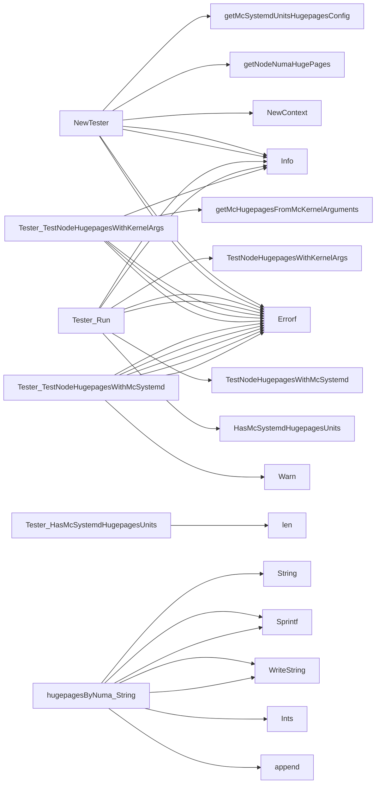

## Package hugepages (github.com/redhat-best-practices-for-k8s/certsuite/tests/platform/hugepages)

### Structs

- **Tester** (exported) — 5 fields, 5 methods

### Functions

- **NewTester** — func(*provider.Node, *corev1.Pod, clientsholder.Command)(*Tester, error)
- **Tester.HasMcSystemdHugepagesUnits** — func()(bool)
- **Tester.Run** — func()(error)
- **Tester.TestNodeHugepagesWithKernelArgs** — func()(bool, error)
- **Tester.TestNodeHugepagesWithMcSystemd** — func()(bool, error)
- **hugepagesByNuma.String** — func()(string)

### Call graph (exported symbols, partial)

### Symbol docs

- [struct Tester](symbols/struct_Tester.md)
- [function NewTester](symbols/function_NewTester.md)
- [function Tester.HasMcSystemdHugepagesUnits](symbols/function_Tester_HasMcSystemdHugepagesUnits.md)
- [function Tester.Run](symbols/function_Tester_Run.md)
- [function Tester.TestNodeHugepagesWithKernelArgs](symbols/function_Tester_TestNodeHugepagesWithKernelArgs.md)
- [function Tester.TestNodeHugepagesWithMcSystemd](symbols/function_Tester_TestNodeHugepagesWithMcSystemd.md)
- [function hugepagesByNuma.String](symbols/function_hugepagesByNuma_String.md)
