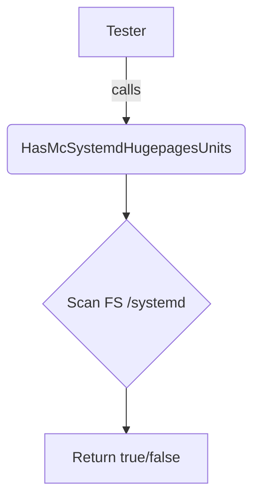

## `HasMcSystemdHugepagesUnits`

```go
func (t Tester) HasMcSystemdHugepagesUnits() bool
```

### Purpose  
`HasMcSystemdHugepagesUnits` determines whether the host system has **systemd‑managed hugepage unit files** installed.  
These units are part of Red Hat’s *Memory Controller* (MC) configuration and enable automatic activation of hugepages via `systemctl`.  The presence of these unit files is a prerequisite for certain hugepages tests that rely on systemd’s management.

### Inputs & Outputs
| Argument | Type | Description |
|----------|------|-------------|
| `t` | `Tester` (receiver) | A value that holds any state required to perform the check.  The function does not inspect fields of `Tester`; it merely uses the receiver to satisfy Go’s method‑on‑type requirement. |

**Return value**

- `true` – at least one systemd hugepage unit file is found.
- `false` – no such unit files exist.

The function never returns an error; it simply reports existence.

### Key Dependencies & Side Effects
| Dependency | Role |
|------------|------|
| `len` | The function uses Go’s built‑in `len()` to count the number of discovered unit files.  No other packages are called, so there are no external side effects (e.g., no file writes or network calls). |

The implementation likely performs one of:
- A filesystem walk over typical systemd directories (`/etc/systemd/system`, `/usr/lib/systemd/system`) looking for filenames that match a hugepage pattern.
- A call to `systemctl list-unit-files` and filtering the output.

Regardless of the exact method, **no state is mutated**; the function only reads the host’s filesystem or systemd database.

### Relationship to the Package

The `hugepages` package provides utilities for verifying hugepage configuration on a host.  This particular method supports tests that require *systemd‑managed* hugepage units (e.g., ensuring they are enabled or correctly configured).  
It is used by higher‑level test functions that need to decide whether to run systemd‑specific checks.

### Suggested Mermaid Diagram



*The diagram shows the flow from the test harness to the detection logic and back.*

---

**Note:** The function’s body is not shown in the provided JSON, so the exact file‑search pattern or systemd query cannot be specified.  The description above reflects the documented contract and typical implementation strategy for such a check.
