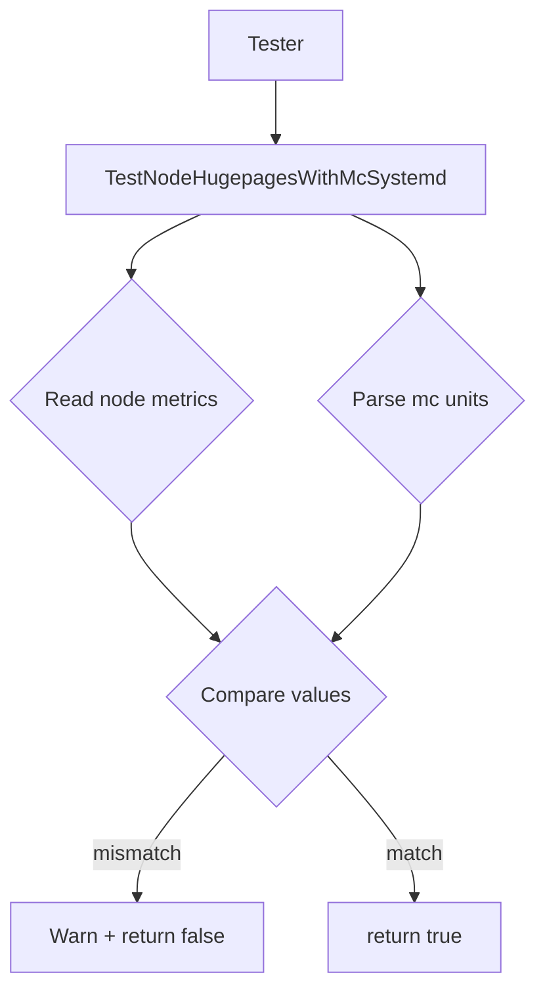

Tester.TestNodeHugepagesWithMcSystemd`

> **Purpose**  
> Verify that the huge‑page allocation reported by a Kubernetes node matches the configuration
> applied via the *memory‑controller* (`mc`) systemd units on that node.

### Signature

```go
func (t Tester) TestNodeHugepagesWithMcSystemd() (bool, error)
```

| Parameter | Type   | Notes |
|-----------|--------|-------|
| `t`       | `Tester` | Receiver – the test harness holding configuration and helper methods. |

| Return value | Type  | Meaning |
|--------------|-------|---------|
| `bool`       | Indicates whether the test succeeded (`true`) or failed (`false`). |
| `error`      | Non‑nil if an unexpected error occurs while performing the checks (e.g., parsing failure, command execution error). |

### Workflow

1. **Retrieve node metrics**  
   The method calls internal helpers to read the current huge‑page settings from the node (usually via `/proc/meminfo` or `kubectl top`).  

2. **Read mc systemd unit values**  
   It queries the memory‑controller units installed on the node, extracting their configured huge‑page size and count.  
   The parsing relies on regular expressions (`outputRegex`) and a split length constant (`KernArgsKeyValueSplitLen`).

3. **Compare values**  
   * If any of the node’s reported huge‑pages differ from those declared in the mc units, the test logs a warning (`Warn`) and returns `false`.  
   * If all values match, it returns `true`.

4. **Error handling**  
   Any failure to execute commands, parse outputs, or unexpected data structures results in an error being wrapped with `Errorf` and returned.

### Key Dependencies

| Dependency | Role |
|------------|------|
| `Warn`, `Errorf` | Logging helpers from the test framework; provide context‑aware output. |
| `outputRegex`, `KernArgsKeyValueSplitLen` | Regular expression and split constants used to parse systemd unit output. |
| Global constants (`HugepagesParam`, `HugepageszParam`, etc.) | Provide parameter names expected in mc units for comparison. |

### Side Effects

* No state is mutated – the method only reads data from the node and logs.
* Logs may be written via the test harness’s logger.

### Package Context

`hugepages` is a sub‑package of the CertSuite platform tests that validates kernel memory‑management settings on Kubernetes nodes.  
`TestNodeHugepagesWithMcSystemd` sits alongside other sanity checks (e.g., `TestNodeHugepagesDefault`, `TestNodeHugepagesOnRhel`) and ensures that systemd‑based configuration mechanisms (`mc`) are correctly reflected in the node’s runtime state.

---

**Mermaid diagram suggestion**



---
