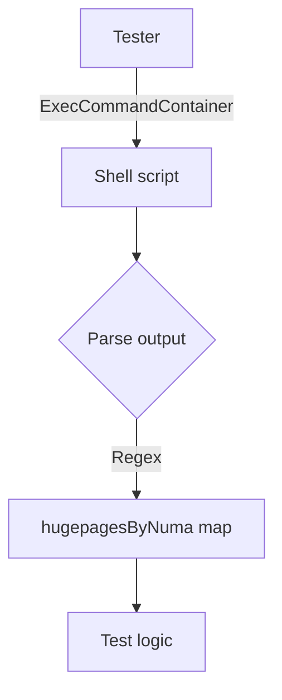

# `getNodeNumaHugePages`

`func (t Tester) getNodeNumaHugePages() (hugepagesByNuma, error)`

## Purpose
Retrieves the actual huge‑page configuration of the node on which the test is running.  
The function reads per‑NUMA node files under `/sys/devices/system/node/`, parses the number of pages and page size, and returns a map keyed by node ID.

## Inputs / Receiver
- `t Tester` – a struct that contains the test environment (e.g., container image name).  
  The receiver is used only to invoke helper methods (`ExecCommandContainer`) on the container under test.

No other parameters are required; all configuration comes from the host file system and hard‑coded constants in the package.

## Outputs
- `hugepagesByNuma` – a map of node number → `hugepageInfo{num, size}` (defined elsewhere in the package).  
  If parsing succeeds for all NUMA nodes, this contains their current huge‑page counts.
- `error` – non‑nil if any step fails: command execution, regex matching, or integer conversion.

## Key Dependencies & Calls
| Call | Reason |
|------|--------|
| `ExecCommandContainer(t.ContainerImageName(), cmd)` | Runs the shell script that lists `/sys/devices/system/node/*/hugepages/...` files and outputs their contents. |
| `Debug`, `Info` | Logging of intermediate values (e.g., raw command output, parsed node data). |
| `New`, `MustCompile` | Compiles the regular expression used to capture node ID and huge‑page info from each line. |
| `Split`, `FindStringSubmatch` | Splits command output into lines and extracts matched groups (`nodeX`, `numHugePages`, `size`). |
| `Atoi` | Converts string numbers to integers for the map values. |

The function relies on constants defined in the same file:

- `cmd` – shell script that prints huge‑page information.
- `outputRegex` – regex pattern to parse each output line.
- `KernArgsKeyValueSplitLen`, `numRegexFields` – used internally by the regex logic.

## Side Effects
The function itself has no mutable state changes; it only reads from the host file system and logs.  
It does **not** modify any configuration or huge‑page settings.

## Package Context
`hugepages` is a test package that verifies correct huge‑page configuration on nodes.  
`getNodeNumaHugePages` is a helper used by higher‑level tests to compare the current state against expected values (e.g., `DefaultHugepagesz`, `RhelDefaultHugepages`). It encapsulates the logic of reading `/sys/devices/system/node/…` and converting it into a Go data structure that other test functions can consume.

---
