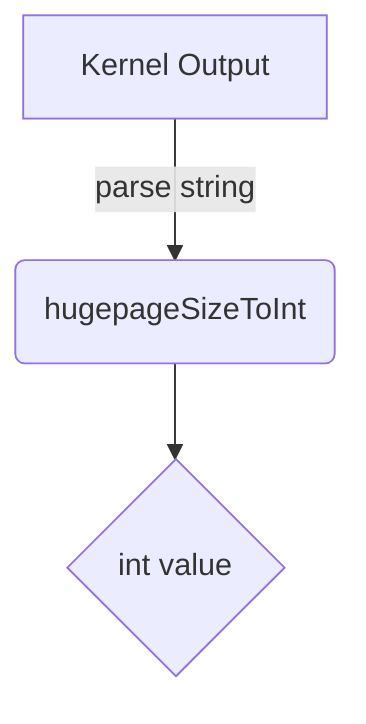

hugepageSizeToInt`

| Attribute | Value |
|-----------|-------|
| **Signature** | `func(string) int` |
| **Exported?** | ❌ (unexported helper) |
| **Package** | `github.com/redhat-best-practices-for-k8s/certsuite/tests/platform/hugepages` |

### Purpose
`hugepageSizeToInt` converts a huge‑page size string returned by the Linux kernel into an integer number of pages.  
The function is used when parsing `/proc/meminfo` or command output that contains values such as `"2048 kB"`. The caller needs the numeric part to perform calculations or comparisons against other sizes.

### Parameters
| Name | Type   | Description |
|------|--------|-------------|
| `s`  | `string` | A string containing a huge‑page size, typically in the format `<number> <unit>` (e.g., `"2048 kB"`). The function expects that the string ends with a space and unit (`kB`, `MByte`, etc.). |

### Return Value
| Type | Description |
|------|-------------|
| `int` | The numeric part of the size, parsed from the input string. If parsing fails, the function returns `0`. |

> **Note**: The caller is responsible for handling a return value of `0` (e.g., by treating it as an error or fallback).

### Implementation Details
1. **Trim the unit suffix**  
   The function removes the last three characters (`len(s)-3`) from the string, assuming they are a space followed by a two‑character unit such as `"kB"`.  
2. **Convert to integer**  
   It uses `strconv.Atoi` (imported as `Atoi`) on the trimmed substring.  
3. **Error handling**  
   If `Atoi` fails, the function silently returns `0`.

```go
func hugepageSizeToInt(s string) int {
    if len(s) < 3 { return 0 }          // defensive check
    numStr := s[:len(s)-3]              // strip "<space><unit>"
    n, err := strconv.Atoi(numStr)
    if err != nil { return 0 }
    return n
}
```

### Dependencies & Side‑Effects
- **Dependencies**  
  - `strconv.Atoi` – for string → integer conversion.  
  - `len` – to compute substring boundaries.
- **Side‑effects**  
  None: the function is pure; it only reads its argument and returns a value.

### Context within the Package
The `hugepages` package tests huge‑page support on Linux platforms. It parses kernel boot arguments (`HugepagesParam`, `HugepageszParam`) and system reports to validate that configured huge‑page sizes match expectations.  
`hugepageSizeToInt` is a small helper invoked by functions that parse textual output (e.g., from `/proc/meminfo` or command line utilities) to extract numeric page counts for further validation logic.

---

**Mermaid suggestion (optional)**



This diagram illustrates how `hugepageSizeToInt` transforms kernel output into a usable integer.
