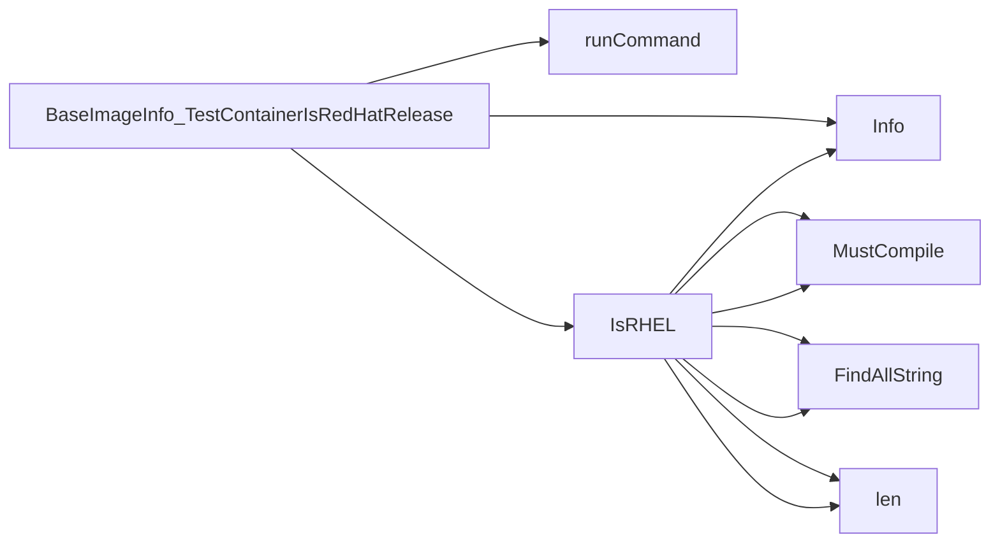

## Package isredhat (github.com/redhat-best-practices-for-k8s/certsuite/tests/platform/isredhat)

### Structs

- **BaseImageInfo** (exported) — 2 fields, 2 methods

### Functions

- **BaseImageInfo.TestContainerIsRedHatRelease** — func()(bool, error)
- **IsRHEL** — func(string)(bool)
- **NewBaseImageTester** — func(clientsholder.Command, clientsholder.Context)(*BaseImageInfo)

### Call graph (exported symbols, partial)

### Symbol docs

- [struct BaseImageInfo](symbols/struct_BaseImageInfo.md)
- [function BaseImageInfo.TestContainerIsRedHatRelease](symbols/function_BaseImageInfo_TestContainerIsRedHatRelease.md)
- [function IsRHEL](symbols/function_IsRHEL.md)
- [function NewBaseImageTester](symbols/function_NewBaseImageTester.md)
