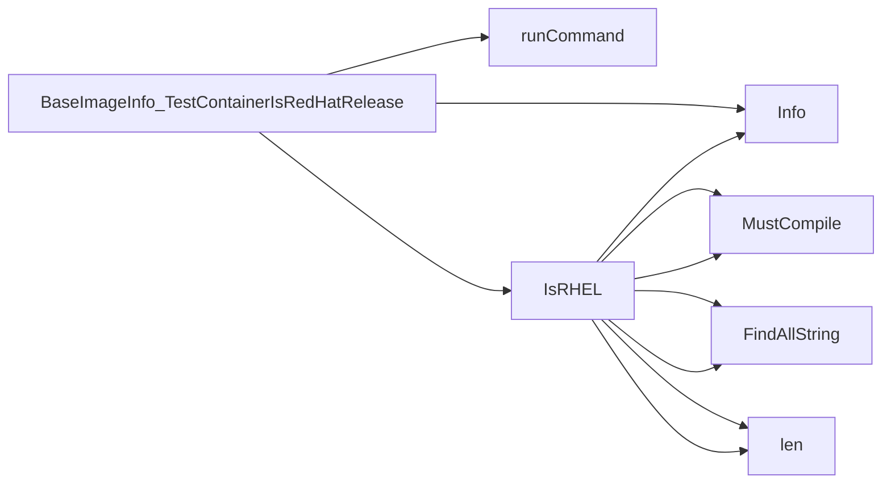

## Package isredhat (github.com/redhat-best-practices-for-k8s/certsuite/tests/platform/isredhat)

## Overview – `isredhat` Test Package

The **`isredhat`** package provides a lightweight helper to determine whether the base image of a container is built from a Red‑Hat / RHEL family distribution.  
It is used by Certsuite’s platform tests when they need to assert that an image satisfies the “Red‑Hat based” requirement.

| Component | Purpose |
|-----------|---------|
| `BaseImageInfo` struct | Holds the command executor and context for interacting with a container. |
| `NewBaseImageTester()` | Constructor that injects a `clientsholder.Command` (exec interface) and `clientsholder.Context`. |
| `TestContainerIsRedHatRelease()` | Public test method that runs a shell check inside the container and returns `(bool, error)` indicating if the image is RHEL‑based. |
| `runCommand()` | Internal helper to execute an arbitrary command inside the target container and return its stdout or error. |
| `IsRHEL(string) bool` | Utility that parses the command output with regular expressions to decide whether the string indicates a Red‑Hat release. |
| Constants | `NotRedHatBasedRegex`, `VersionRegex` – regex patterns used by `IsRHEL`. |

---

### Data Structures

```go
type BaseImageInfo struct {
    ClientHolder clientsholder.Command // Exec interface (e.g., kubectl exec)
    OCPContext   clientsholder.Context // Namespace, pod name, etc.
}
```

* **`ClientHolder`** – Provides `ExecCommandContainer(ctx, cmd)` to run commands inside a container.  
* **`OCPContext`** – Encapsulates the context needed for that execution (pod, namespace, container).

---

### Key Functions

#### 1. Constructor

```go
func NewBaseImageTester(cmd clientsholder.Command, ctx clientsholder.Context) *BaseImageInfo
```

Creates a new `BaseImageInfo` instance with the supplied exec command interface and context.

#### 2. Public Test Method

```go
func (b BaseImageInfo) TestContainerIsRedHatRelease() (bool, error)
```

* Runs `runCommand("cat /etc/os-release")`.  
* If execution fails → logs an error and returns `(false, err)`.  
* Passes the command output to `IsRHEL` to determine if it matches a Red‑Hat release.  
* Returns the boolean result along with any error.

#### 3. Internal Command Runner

```go
func (b BaseImageInfo) runCommand(cmd string) (string, error)
```

1. Calls `ExecCommandContainer(b.OCPContext, cmd)` from the injected client.  
2. If the exec call fails → logs and returns an `Error` wrapped with context.  
3. Otherwise, trims and returns the command’s stdout.

#### 4. Red‑Hat Detection

```go
func IsRHEL(output string) bool
```

* Compiles two regexes at runtime:
  * **NotRedHatBasedRegex** – matches patterns that indicate non‑Red‑Hat systems (`fedora`, `centos`, etc.).  
  * **VersionRegex** – matches the `VERSION_ID` field from `/etc/os-release`.  
* Checks if either regex finds a match in the output.  
* Logs information via `log.Info()` when matches are found.
* Returns `true` only when both checks succeed, meaning the image is Red‑Hat based.

---

### Flow Diagram (Mermaid)

```mermaid
flowchart TD
    A[Client] -->|ExecCommandContainer| B{runCommand}
    B --> C["cat /etc/os-release"]
    C --> D[output string]
    D --> E[IsRHEL(output)]
    E --> F{is RHEL?}
    F -- Yes --> G[return (true, nil)]
    F -- No  --> H[return (false, nil)]
```

---

### How It Connects to the Rest of Certsuite

* **Test Suite Integration** – Other tests instantiate `BaseImageInfo` via `NewBaseImageTester`, then call `TestContainerIsRedHatRelease()` before proceeding with platform‑specific checks.  
* **Logging & Error Handling** – Uses `github.com/redhat-best-practices-for-k8s/certsuite/internal/log` for structured logs; errors are wrapped with contextual messages (`errors.New`).  
* **Extensibility** – The command string is hardcoded to read `/etc/os-release`, but the design allows alternative checks by modifying `runCommand`.

---

### Summary

The `isredhat` package offers a focused, reusable mechanism to verify that a container image originates from Red‑Hat. It abstracts away exec logic, uses regex parsing for reliability, and integrates cleanly with Certsuite’s testing framework.

### Structs

- **BaseImageInfo** (exported) — 2 fields, 2 methods

### Functions

- **BaseImageInfo.TestContainerIsRedHatRelease** — func()(bool, error)
- **IsRHEL** — func(string)(bool)
- **NewBaseImageTester** — func(clientsholder.Command, clientsholder.Context)(*BaseImageInfo)

### Call graph (exported symbols, partial)



### Symbol docs

- [struct BaseImageInfo](symbols/struct_BaseImageInfo.md)
- [function BaseImageInfo.TestContainerIsRedHatRelease](symbols/function_BaseImageInfo_TestContainerIsRedHatRelease.md)
- [function IsRHEL](symbols/function_IsRHEL.md)
- [function NewBaseImageTester](symbols/function_NewBaseImageTester.md)
