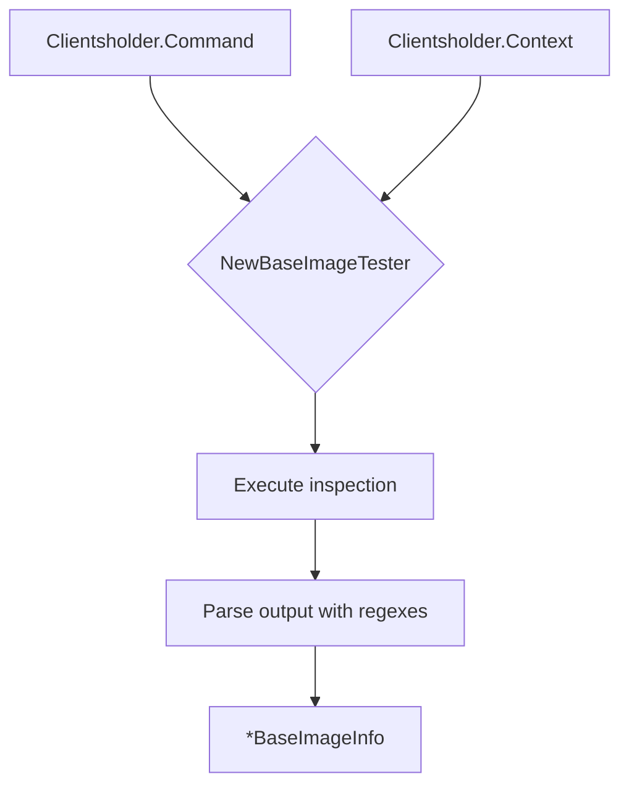

NewBaseImageTester` – Package `isredhat`

| Item | Description |
|------|-------------|
| **Signature** | `func NewBaseImageTester(clientsholder.Command, clientsholder.Context) *BaseImageInfo` |
| **Purpose** | Creates a new test harness for inspecting the base image of a container. The function returns a pointer to a `BaseImageInfo` struct that contains metadata (e.g., name, tag, digest) and flags indicating whether the image originates from Red Hat or not. |

## Inputs

| Parameter | Type | Role |
|-----------|------|------|
| `cmd` | `clientsholder.Command` | Abstraction over a command‑execution client (e.g., Docker, Podman). The tester will use this to run inspection commands against the image. |
| `ctx` | `clientsholder.Context` | Execution context that carries timeouts, cancellation signals, and any environment variables needed for the command execution. |

## Output

* **`*BaseImageInfo`** – A pointer to a struct holding:
  * The image name (e.g., `"registry.redhat.io/ubi8/ubi"`).
  * The resolved tag or digest.
  * Boolean flags such as `IsRedHatBased` derived from regular expressions (`NotRedHatBasedRegex`, `VersionRegex`) defined in the package.

If the command fails or the image cannot be inspected, the function may return `nil` (implementation‑dependent).

## Dependencies & Key Constants

* **`NotRedHatBasedRegex`** – Regular expression used to filter out images that are *not* from Red Hat.  
* **`VersionRegex`** – Regular expression used to extract version information from an image tag or digest.

These constants are applied inside the function when parsing the output of the inspection command.

## Side‑Effects

The function is read‑only with respect to the global state; it only executes external commands via `cmd`. No modifications are made to package globals, files, or network resources beyond what the underlying command client performs.

## How It Fits the Package

`isredhat` provides utilities for determining whether a given container image originates from Red Hat.  
* `NewBaseImageTester` is the entry point that prepares a tester instance, which other test functions in this package (e.g., `TestRedHatBased`, `TestVersionExtraction`) use to perform assertions on images.  
* The returned `BaseImageInfo` object is consumed by those tests to verify compliance with Red Hat’s best‑practice requirements.

---

### Suggested Mermaid Diagram

This diagram illustrates the data flow from command & context to the final `BaseImageInfo` object.
