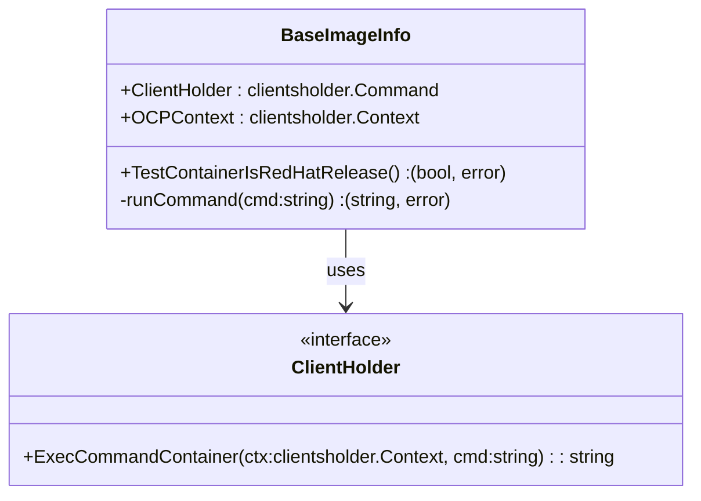

BaseImageInfo` – A Lightweight Base‑Image Inspector

| Field | Type | Description |
|-------|------|-------------|
| `ClientHolder` | `clientsholder.Command` | An object that knows how to run arbitrary commands inside a running container. |
| `OCPContext`   | `clientsholder.Context` | Holds the OpenShift/Kubernetes client configuration (e.g., kube‑config, namespace) needed by `ClientHolder`. |

`BaseImageInfo` lives in **github.com/redhat-best-practices-for-k8s/certsuite/tests/platform/isredhat** and is used only by tests that need to inspect the base image of a container.  
Its sole responsibility is *querying* information about the image – it does not modify the container or its state.

---

## Key Methods

### `TestContainerIsRedHatRelease() (bool, error)`

```go
func (b *BaseImageInfo) TestContainerIsRedHatRelease() (bool, error)
```

**Purpose**  
Determines whether the running container is based on a Red‑Hat Enterprise Linux (RHEL) release.

**Workflow**

1. **Run `cat /etc/redhat-release`** inside the container via `runCommand`.  
   *If this file does not exist or cannot be read, the method returns an error.*  
2. **Parse the output** with `IsRHEL`, a helper that checks for known RHEL version strings.  
3. Return the boolean result and any error that occurred.

**Dependencies**

| Dependency | Role |
|------------|------|
| `runCommand` | Executes the shell command inside the container. |
| `Info` (from Go’s `log` package) | Logs debug information when a command is run. |
| `IsRHEL` | Parses `/etc/redhat-release` content to detect RHEL. |

**Side‑effects**

* Writes to standard logger via `Info`.  
* No modification of the container or its filesystem.

---

### `runCommand(cmd string) (string, error)`

```go
func (b *BaseImageInfo) runCommand(cmd string) (string, error)
```

**Purpose**  
Utility that runs a single command inside the target container and returns its stdout.

**Workflow**

1. Calls `ExecCommandContainer` from `ClientHolder`, passing the container context (`OCPContext`) and the shell command.  
2. On success, trims trailing newlines and returns the output string.  
3. On failure, wraps the error with a descriptive message via `Error()` (from `log`).

**Dependencies**

| Dependency | Role |
|------------|------|
| `ExecCommandContainer` | Executes commands inside containers. |
| `Error` (logger) | Formats error messages for debugging. |
| `New` (error helper) | Constructs new errors when command execution fails. |

**Side‑effects**

* Only logs errors; no state mutation.

---

## Construction

```go
func NewBaseImageTester(clientsholder.Command, clientsholder.Context) *BaseImageInfo
```

Creates a new `BaseImageInfo` instance by assigning the provided `clientsholder.Command` and `clientsholder.Context`.  
It is intentionally minimal: all state needed for command execution is supplied at construction time.

---

## Package Interaction

The **isredhat** package is part of CertSuite’s platform tests.  
Typical usage:

```go
tester := NewBaseImageTester(cmdHolder, ctx)
ok, err := tester.TestContainerIsRedHatRelease()
```

- `cmdHolder` knows how to talk to the container runtime (Docker/Kubelet).  
- `ctx` provides namespace and pod information.  

The result (`ok`) tells the test harness whether a given pod uses a RHEL‑based image, which is critical for compliance checks that rely on Red‑Hat specific features.

---

## Mermaid Diagram (Optional)



This diagram visualises the relationship between `BaseImageInfo` and its dependency on `ClientHolder`.
