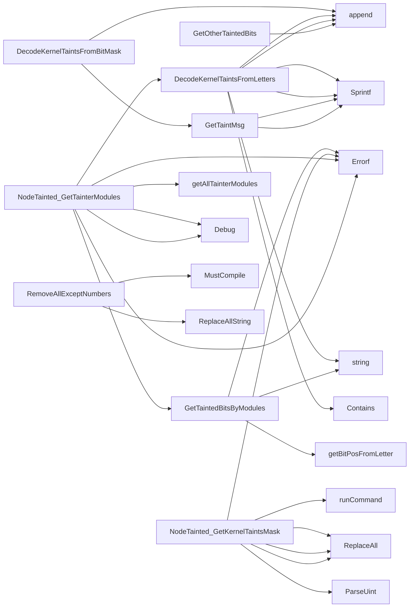

## Package nodetainted (github.com/redhat-best-practices-for-k8s/certsuite/tests/platform/nodetainted)

### Structs

- **KernelTaint** (exported) — 2 fields, 0 methods
- **NodeTainted** (exported) — 2 fields, 3 methods

### Functions

- **DecodeKernelTaintsFromBitMask** — func(uint64)([]string)
- **DecodeKernelTaintsFromLetters** — func(string)([]string)
- **GetOtherTaintedBits** — func(uint64, map[int]bool)([]int)
- **GetTaintMsg** — func(int)(string)
- **GetTaintedBitsByModules** — func(map[string]string)(map[int]bool, error)
- **NewNodeTaintedTester** — func(*clientsholder.Context, string)(*NodeTainted)
- **NodeTainted.GetKernelTaintsMask** — func()(uint64, error)
- **NodeTainted.GetTainterModules** — func(map[string]bool)(map[string]string, map[int]bool, error)
- **RemoveAllExceptNumbers** — func(string)(string)

### Globals

### Call graph (exported symbols, partial)

### Symbol docs

- [struct KernelTaint](symbols/struct_KernelTaint.md)
- [struct NodeTainted](symbols/struct_NodeTainted.md)
- [function DecodeKernelTaintsFromBitMask](symbols/function_DecodeKernelTaintsFromBitMask.md)
- [function DecodeKernelTaintsFromLetters](symbols/function_DecodeKernelTaintsFromLetters.md)
- [function GetOtherTaintedBits](symbols/function_GetOtherTaintedBits.md)
- [function GetTaintMsg](symbols/function_GetTaintMsg.md)
- [function GetTaintedBitsByModules](symbols/function_GetTaintedBitsByModules.md)
- [function NewNodeTaintedTester](symbols/function_NewNodeTaintedTester.md)
- [function NodeTainted.GetKernelTaintsMask](symbols/function_NodeTainted_GetKernelTaintsMask.md)
- [function NodeTainted.GetTainterModules](symbols/function_NodeTainted_GetTainterModules.md)
- [function RemoveAllExceptNumbers](symbols/function_RemoveAllExceptNumbers.md)
