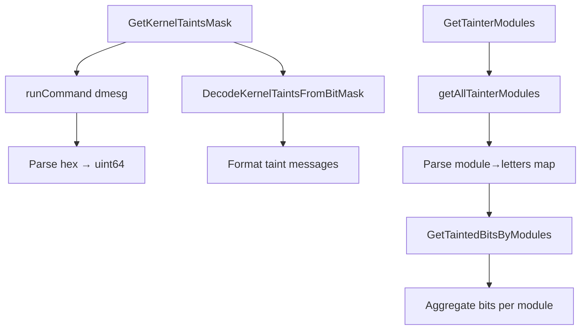
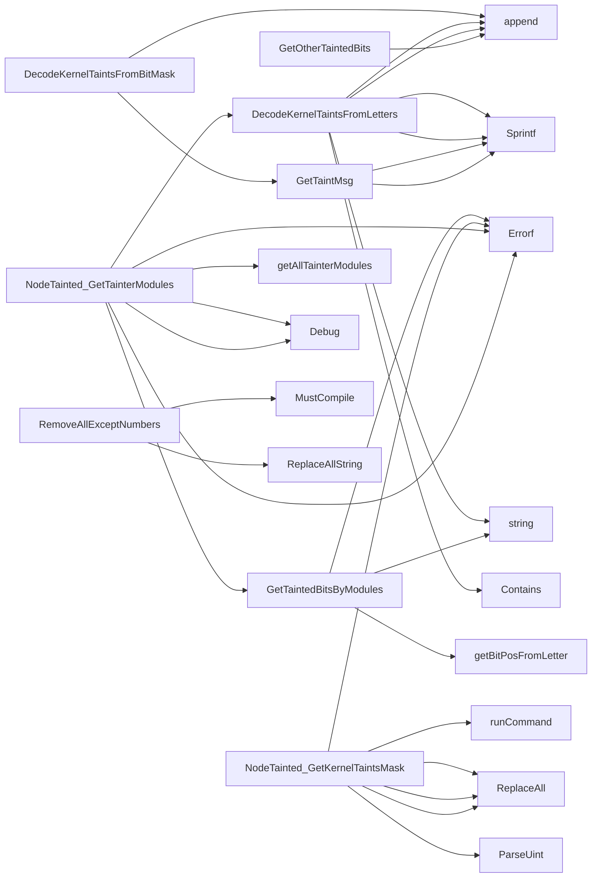

## Package nodetainted (github.com/redhat-best-practices-for-k8s/certsuite/tests/platform/nodetainted)

# nodetainted package – Overview

The **nodetainted** package is a small, read‑only helper that runs commands on a Kubernetes node and interprets the kernel taint mask reported by the node’s `dmesg` or `/proc/sys/kernel/taint`.  
Its goal is to determine which kernel modules have caused taints and which bits in the 64‑bit taint mask are set.

> **Note**: The package contains no mutable state; all exported values are read‑only. It is meant to be used by test suites that need to validate node taint conditions.

---

## Core Data Structures

| Type | Purpose | Key Fields |
|------|---------|------------|
| `KernelTaint` | Describes a single kernel taint bit. Not directly used in the current code (kept for future reference). | `Description string`, `Letters string` |
| `NodeTainted` | Holds context for executing commands on a node and the target node name. <br>It exposes methods that walk the workflow of retrieving taints from the node. | `ctx *clientsholder.Context` – holds SSH/Kube client info.<br>`node string` – the Kubernetes node name. |

---

## Global Helpers

| Name | Type | Purpose |
|------|------|---------|
| `runCommand` | function variable (assigned in init) | Executes a shell command on the target node via `clientsholder`. The assignment is hidden but it is called by all public methods that need to query the node. |
| `kernelTaints` | map[int]KernelTaint | Maps bit positions to known taint letters/descriptions. It is used only by `GetTaintMsg` (via string formatting). |

---

## Key Public Functions

### 1. `NewNodeTaintedTester(ctx, node) *NodeTainted`
Creates a new `NodeTainted` instance that can be reused across multiple calls.

```go
func NewNodeTaintedTester(ctx *clientsholder.Context, node string) *NodeTainted {
    return &NodeTainted{ctx: ctx, node: node}
}
```

### 2. `GetKernelTaintsMask() (uint64, error)`
Runs the command:

```bash
dmesg | grep -Eo 'kernel taint: .*' | head -n1 | awk '{print $NF}'
```

On the target node and parses the hex value into a 64‑bit integer.  
The method normalises whitespace and removes non‑hex characters.

### 3. `GetTainterModules(allowlist map[string]bool) (map[string]string, map[int]bool, error)`
* **Goal** – Find every kernel module that has set at least one taint bit on the node.  
* **Workflow**
  1. Calls `getAllTainterModules()` to parse the output of `modinfo -a | grep ^taint` (or similar).  
  2. Builds a map `tainters: module → letters` and a set `taintBits` for all bits caused by any module, including allowlisted ones.  
  3. If a module is in the `allowlist`, its letters are ignored but its bits still contribute to `taintBits`.  

### 4. `getAllTainterModules() (map[string]string, error)`
Runs a node command that lists modules and their taint letters, then parses it into a map:

```go
module <modname> taints: <letters>
```

Any parsing errors are wrapped in an `Errorf`.

### 5. `GetTaintedBitsByModules(modules map[string]string) (map[int]bool, error)`
Converts each module’s letters to bit positions using `getBitPosFromLetter` and aggregates them into a set.

### 6. Decoding helpers
* **`DecodeKernelTaintsFromBitMask(mask uint64) []string`** – Turns a numeric mask into the list of taint messages (`GetTaintMsg`).  
* **`DecodeKernelTaintsFromLetters(letters string) []string`** – Maps letters to their bit positions and formats them.  

### 7. Utility helpers
| Function | Purpose |
|----------|---------|
| `RemoveAllExceptNumbers(s string)` | Strips all non‑numeric characters (used when parsing hex values). |
| `GetTaintMsg(bit int) string` | Returns a formatted string describing the taint bit, e.g. `"bit 5: memory allocation failure"`. |
| `getBitPosFromLetter(letter string) (int, error)` | Maps a single letter to its 0‑based bit index in the kernel taint mask. |

---

## Typical Usage Flow

```go
ctx := clientsholder.NewContext(...)
tester := NewNodeTaintedTester(ctx, "node-1")

mask, err := tester.GetKernelTaintsMask()
if err != nil { /* handle */ }

bits, err := DecodeKernelTaintsFromBitMask(mask)
fmt.Println("All taints:", bits)

tainters, allBits, err := tester.GetTainterModules(map[string]bool{"kubelet": true})
// `tainters` contains only non‑allowlisted modules.
// `allBits` includes bits from allowlisted modules too.
```

---

## Mermaid Flow Diagram (Suggested)



---

## Summary

* **NodeTainted** is the primary abstraction; it bundles a node context and offers methods to fetch and interpret kernel taints.  
* The package relies heavily on executing shell commands on the target node and parsing their output.  
* All data flows are read‑only: the global `runCommand` function does not alter state, and all maps/sets returned by functions are copies.

This design keeps the logic testable while delegating actual command execution to an external client holder, making it suitable for unit tests that mock node responses.

### Structs

- **KernelTaint** (exported) — 2 fields, 0 methods
- **NodeTainted** (exported) — 2 fields, 3 methods

### Functions

- **DecodeKernelTaintsFromBitMask** — func(uint64)([]string)
- **DecodeKernelTaintsFromLetters** — func(string)([]string)
- **GetOtherTaintedBits** — func(uint64, map[int]bool)([]int)
- **GetTaintMsg** — func(int)(string)
- **GetTaintedBitsByModules** — func(map[string]string)(map[int]bool, error)
- **NewNodeTaintedTester** — func(*clientsholder.Context, string)(*NodeTainted)
- **NodeTainted.GetKernelTaintsMask** — func()(uint64, error)
- **NodeTainted.GetTainterModules** — func(map[string]bool)(map[string]string, map[int]bool, error)
- **RemoveAllExceptNumbers** — func(string)(string)

### Globals


### Call graph (exported symbols, partial)



### Symbol docs

- [struct KernelTaint](symbols/struct_KernelTaint.md)
- [struct NodeTainted](symbols/struct_NodeTainted.md)
- [function DecodeKernelTaintsFromBitMask](symbols/function_DecodeKernelTaintsFromBitMask.md)
- [function DecodeKernelTaintsFromLetters](symbols/function_DecodeKernelTaintsFromLetters.md)
- [function GetOtherTaintedBits](symbols/function_GetOtherTaintedBits.md)
- [function GetTaintMsg](symbols/function_GetTaintMsg.md)
- [function GetTaintedBitsByModules](symbols/function_GetTaintedBitsByModules.md)
- [function NewNodeTaintedTester](symbols/function_NewNodeTaintedTester.md)
- [function NodeTainted.GetKernelTaintsMask](symbols/function_NodeTainted_GetKernelTaintsMask.md)
- [function NodeTainted.GetTainterModules](symbols/function_NodeTainted_GetTainterModules.md)
- [function RemoveAllExceptNumbers](symbols/function_RemoveAllExceptNumbers.md)
