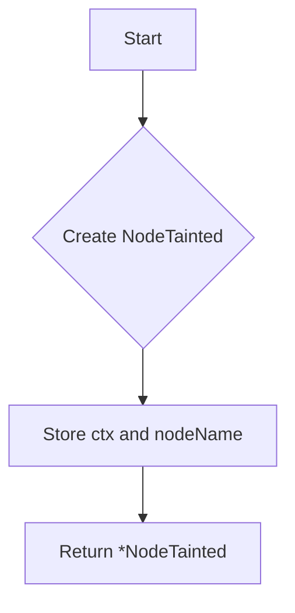

NewNodeTaintedTester`

| Item | Details |
|------|---------|
| **Signature** | `func(*clientsholder.Context, string) *NodeTainted` |
| **Purpose** | Constructs a test helper that can query whether a Kubernetes node is marked as *tainted* (i.e., has one of the taint keys defined in `kernelTaints`). |

### Parameters

| Parameter | Type | Role |
|-----------|------|------|
| `ctx` | `*clientsholder.Context` | Holds shared resources (e.g., Kubernetes client, logger) that the tester will use to execute commands on nodes. |
| `nodeName` | `string` | The name of the node whose taint status should be inspected. |

### Return Value

- A pointer to a freshly created `NodeTainted` struct which encapsulates all information needed to run the taint check against the specified node.

### Key Dependencies & Side‑Effects

| Dependency | How it is used |
|------------|----------------|
| `runCommand` | Internal helper that executes a shell command on the node. The tester will call this function to retrieve the current taints via `kubectl describe node <node>`. |
| `kernelTaints` | Slice of known kernel‑taint keys (e.g., `"node.kubernetes.io/unschedulable"`). These keys are used by `NodeTainted` to decide if a taint is relevant. |
| `clientsholder.Context` | Provides the necessary client for executing remote commands; no state is mutated in this function itself. |

### Flow Overview (Mermaid)

### How It Fits the Package

The `nodetainted` package supplies a reusable tester for checking node taint status.  
- `NewNodeTaintedTester` is the factory function that creates an instance of this tester.  
- The returned `*NodeTainted` object exposes methods (not shown here) that perform the actual check, leveraging the `runCommand` helper and the `kernelTaints` list.  
- Test cases in the package instantiate a tester via this function and then invoke its public API to assert taint conditions on nodes.

---

**Bottom line:** `NewNodeTaintedTester` is a thin constructor that bundles together context and node identity, preparing the rest of the `nodetainted` test suite for execution.
