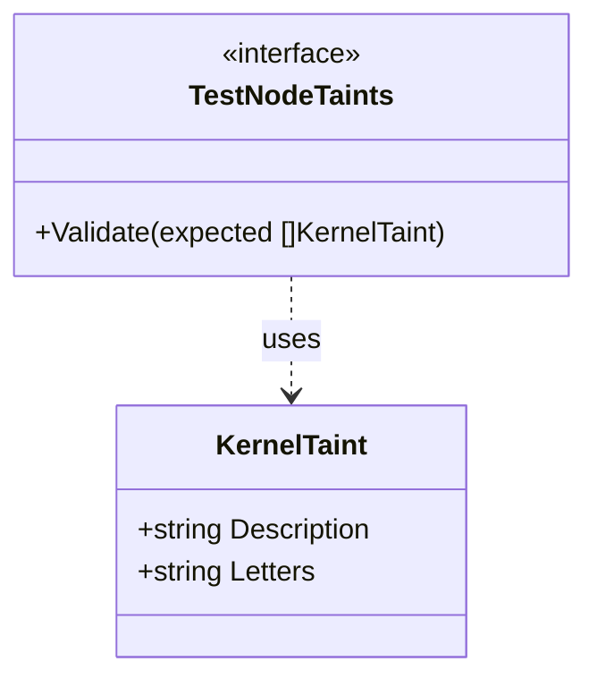

KernelTaint` – Test‑time representation of a Kubernetes node’s kernel taint

| Item | Details |
|------|---------|
| **Package** | `nodetainted` (github.com/redhat-best-practices-for-k8s/certsuite/tests/platform/nodetainted) |
| **Purpose** | Holds the minimal information required by the test harness to describe a kernel‑level taint that should be present on a node. Tests use this struct to *expect* a taint and then assert that the node’s actual taints match these expectations. |
| **Fields** | - `Description string` – Human‑readable explanation of why the taint is applied (e.g., “kernel module not signed”).    - `Letters string` – The one‑ or two‑letter code(s) that identify the taint type in Kubernetes (e.g., `"M"` for *malicious*, `"P"` for *panic*). |
| **Dependencies** | • Relies on Kubernetes’ taint representation (`v1.Taint`) when comparing expected vs. actual taints. • The test suite’s helper functions parse this struct to construct the `v1.Taint` objects used in assertions. |
| **Side‑effects** | None – it is a plain data container; no methods or exported functions modify state. |
| **How it fits the package** | The `nodetainted` package contains tests that verify node taint handling across the platform. Each test declares one or more `KernelTaint` values to describe expected taints, then uses them in assertions against the live cluster. This struct centralises the definition of those expectations and keeps the test code readable. |

### Suggested Mermaid diagram

This diagram illustrates that the test logic (`TestNodeTaints`) consumes `KernelTaint` instances to perform validation.
