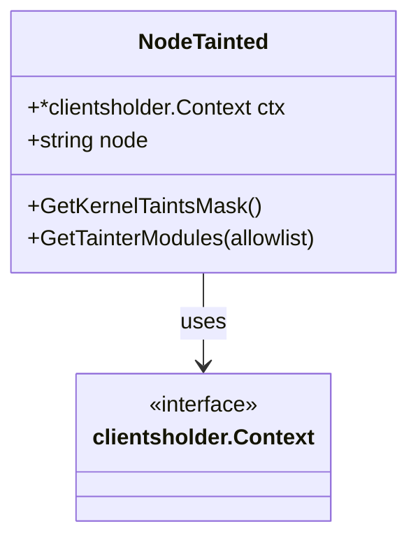

NodeTainted` – Node‑taint inspection helper

The **`NodeTainted`** type is a small helper that encapsulates the logic required to
query a Kubernetes node for kernel taints and the modules that caused them.
It lives in the *nodetainted* test package, which is part of CertSuite’s platform
testing suite.

## Purpose

- **Expose a single API surface** (`GetKernelTaintsMask`, `GetTainterModules`)
  that can be used by other tests to assert node health.
- **Hide all SSH/exec plumbing** behind the `clientsholder.Context` field,
  keeping callers agnostic of how commands are run on the remote node.

## Fields

| Field | Type | Description |
|-------|------|-------------|
| `ctx` | `*clientsholder.Context` | Holds a reference to the SSH client configuration and helper functions that allow running shell commands on the target node. |
| `node` | `string` | The Kubernetes node name (or IP) where commands will be executed. |

Both fields are immutable after construction; the struct is created via
`NewNodeTaintedTester`.

## Construction

```go
func NewNodeTaintedTester(ctx *clientsholder.Context, node string) *NodeTainted
```

- **Inputs**
  - `ctx`: The SSH context used to run remote commands.
  - `node`: Identifier of the node under test.
- **Output**: A pointer to a fully initialized `NodeTainted`.

The constructor simply stores the arguments; it performs no I/O.

## Methods

### `GetKernelTaintsMask() (uint64, error)`

Retrieves the *kernel taint mask* for the node.

1. Runs `cat /proc/sys/kernel/taints` on the remote node via `runCommand`.
2. Cleans the output (removes whitespace and newlines).
3. Parses the remaining string as a base‑10 unsigned integer (`ParseUint`).
4. Returns the parsed mask or an error if any step fails.

**Side effects**

- Executes a command on the target node.
- No state is mutated in `NodeTainted`.

### `GetTainterModules(allowlist map[string]bool) (map[string]string, map[int]bool, error)`

Determines which kernel modules have set taint bits and what those bits are.

| Return | Meaning |
|--------|---------|
| `tainters` (`map[string]string`) | Module name → string of taint letters (e.g. `"D"`, `"S"`). Modules on the allowlist are omitted. |
| `taintBits` (`map[int]bool`) | Bit positions that have been set by any module (including allowlisted ones). |
| `error` | Failure during command execution or parsing. |

**Algorithm**

1. Calls private helper `getAllTainterModules()` to fetch a mapping of modules
   to their taint letters.
2. For each entry, decodes the string of letters into a bit mask via
   `DecodeKernelTaintsFromLetters`.
3. Aggregates all bits into `taintBits`.
4. Filters out any module that appears in the supplied `allowlist`.

**Side effects**

- Executes shell commands on the node.
- No mutation of struct fields.

### `getAllTainterModules() (map[string]string, error)` *(unexported)*

Internal helper that runs a single command to list all modules which have
reported taints:

```bash
lsmod | awk '/^.*_taint/ {print $1, $2}'
```

The method parses the output into a map of `module -> taintLetters`.  
If parsing fails or the command returns an error, it propagates that error.

**Side effects**

- Executes one remote command.
- No mutation of struct fields.

## Dependencies

| Dependency | Role |
|------------|------|
| `clientsholder.Context` | Provides SSH client and helper functions (`runCommand`, etc.). |
| `runCommand` | Low‑level function that runs a shell command on the node. |
| `DecodeKernelTaintsFromLetters` | Converts taint letter strings into bit masks. |
| `Errorf`, `Debug` | Logging helpers for error reporting and debugging. |

All dependencies are *read‑only*; `NodeTainted` never modifies global state.

## Integration in the package

The **nodetainted** package is a test helper used by other CertSuite tests to
assert that nodes are not tainted or that specific modules do not cause taints.
Typical usage pattern:

```go
tester := nodetainted.NewNodeTaintedTester(ctx, nodeName)
mask, err := tester.GetKernelTaintsMask()
if mask != 0 {
    t.Fatalf("node %s is tainted", nodeName)
}
```

or

```go
tainters, bits, err := tester.GetTainterModules(allowlist)
for mod, letters := range tainers { … }
```

By centralising taint logic here, tests remain concise and the underlying
command‑execution mechanics are isolated.

---

### Mermaid diagram (optional)



This diagram visualises that `NodeTainted` depends on a context capable of
executing remote commands.
